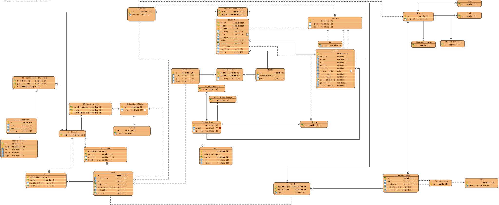

# Database Naming Conventions, Documents and Scripts

This document serves as the aggregation of all the small reports related to the database
that are scattered along this project. This project will have into account the following topics:

1. [Database Naming Conventions](#database-naming-conventions)
2. [Docs](#docs)
3. [Scripts](#scripts)
4. [Database Physical Structure](#database-physical-structure)
5. [Database Logic](#database-logic)
6. [Models](#models)


# Database Naming Conventions
* [Check isolated file](./conventions/Database%20Naming%20Conventions.md)

## Rules

* **Table names** must not include protected keywords for Oracle SQL (ex. User, Dual, Start, etc.)
* **Table names** must follow the proper Camel case with the first letter of name capitalized (ex. Sensor, WaterSensor, Fertilizer, etc. What not to follow: sensor, waterSensor, PoTassicfertilizer,etc.)
* **Table Attributes** must follow proper camel case with first character not capitalized (ex. amount, numberOfSensors, cultivationType, etc.),
* **Table Attributes Constraints**, if inside table creation, may (or may not) have a dedicated name (ex. check (regex_like(code,"\d{8}\w{3}"))).
* **Table Attributes Constraints**, if outside table, as an alter table, it must have a name as the following form CC[TABLE_NAME]_[DESCRIPTION], where CC is the type of constraint (see constraint table in use), [TABLE_NAME] is the name of the table and [DESCRIPTION] is a description to identify what the constraint aims to achieve
* **Primary Key[s]** must be as simple as possible, using camel case, with first character uncapitalized, and, in preference, one word long (ex. code, name, id. What not to follow: idOfTeam, teamId, teamID, ID, Id, iD, idTeam, etc.)
* **Foreign Key[s]** must follow the same rules as **Primary Key[s]** and the name must be related to the relation that results in the **Foreign Key[s]** (ex. Assume entity *Music (M)* has multiple *CD (C)*, *M* "1" -> "1..N" *C*, then the **Foreign Key[s]** name in entity *Music* must be **cd**, and not cdCode, codeOfCd, fkCD, cdFK, etc. )
* **Functions** must follow the convention fncUS[NNN][Designation], where NNN is the number of the US stated in the requirements and the description the function main goal, in Camel Case
* **Procedures** must follow the convention prcUS[NNN][Designation], where NNN is the number of the US stated in the requirements and the description the procedure main goal, in Camel Case
* **Triggers** must follow the convention trg[Designation], where designation is the triggers main goal, in Camel Case
## Table Resume

|         Database Entity         | Rule                                                                                                                                                                                                                                                                                                                              |
|:-------------------------------:|:----------------------------------------------------------------------------------------------------------------------------------------------------------------------------------------------------------------------------------------------------------------------------------------------------------------------------------|
|         **Table Name**          | Must not include protected keywords for Oracle SQL (ex. User, Dual, Start, etc.)                                                                                                                                                                                                                                                  |
|                                 | Must follow the proper Camel case with the first letter of name capitalized (ex. Sensor, WaterSensor, Fertilizer, etc. What not to follow: sensor, waterSensor, PoTassicfertilizer,etc.)                                                                                                                                          |
|       **Table Attribute**       | Must follow proper camel case with first character not capitalized (ex. amount, numberOfSensors, cultivationType, etc.)                                                                                                                                                                                                           |
| **Table Attributes Constraint** | If inside table creation, may (or may not) have a dedicated name (ex. check (regex_like(code,"\d{8}\w{3}"))).                                                                                                                                                                                                                     |
|                                 | If outside table, as an alter table, it must have a name as the following form CC[TABLE_NAME]_[DESCRIPTION], where CC is the type of constraint (see constraint table in use), [TABLE_NAME] is the name of the table and [DESCRIPTION] is a description to identify what the constraint aims to achieve                           |
|       **Primary Key[s]**        | Must be as simple as possible, using camel case, with first character uncapitalized, and, in preference, one word long (ex. code, name, id. What not to follow: idOfTeam, teamId, teamID, ID, Id, iD, idTeam, etc.)                                                                                                               |
|       **Foreign Key[s]**        | Must follow the same rules as **Primary Key[s]** and the name must be related to the relation that results in the **Foreign Key[s]** (ex. Assume entity *Music (M)* has multiple *CD (C)*, *M* "1" -> "1..N" *C*, then the **Foreign Key[s]** name in entity *Music* must be **cd**, and not cdCode, codeOfCd, fkCD, cdFK, etc. ) |
|          **Function**           | Functions must follow the convention fncUS[NNN][Designation], where NNN is the number of the US stated in the requirements and the description the function main goal, in Camel Case                                                                                                                                              |                                                                                                                                                                                                                                                                                                                        |
|          **Procedure**          | Procedures must follow the convention prcUS[NNN][Designation], where NNN is the number of the US stated in the requirements and the description the procedure main goal, in Camel Case                                                                                                                                            |
|           **Trigger**           | Triggers must follow the convention trg[Designation], where designation is the triggers main goal, in Camel Case                                                                                                                                                                                                                  |


## Constraints Table

| Constraint Name | Constraint Key |
|:---------------:|:--------------:|
|   Foreign Key   |     **FK**     |
|   Primary Key   |     **PK**     |
|    Not Null     |     **NN**     |
|     Unique      |     **UQ**     |
|     Default     |     **DF**     |
|      Index      |     **ID**     |

Note: The SQL syntax is case insensitive, so for everything that is related to Camel case, it only applies to diagrams and documentation.

# Docs

* [Check isolated file](./docs/README.md)

## Dictionary

|         **Entry Name**          |                                                                     **Definition**                                                                      |
|:-------------------------------:|:-------------------------------------------------------------------------------------------------------------------------------------------------------:|
|           **Address**           |                                        Represents an address of an individual/user and/or building/hub/location                                         |
|          **AuditLog**           |                                      Table responsible for recording any table alterations by a given system user                                       |
|           **Basket**            |                                                       The aggregate of products of a given basket                                                       |
|         **BasketOrder**         |                                                         The order of a given basket by a client                                                         |
|        **BasketProduct**        |                                          The product that is included on a given basket, and their quantities                                           |
|          **Building**           |                                                     Place of an exploration that has constructions                                                      |
|           **Client**            |                                                            System user that can order basket                                                            |
|        **CropWatering**         |                                             The registration of the watering of the crops of a given sector                                             |
|         **CulturePlan**         |                         The plan used by a given sprinkling system to coordinate how to water the crops of a given exploration                          |
|     **DistributionManager**     |                                 System user responsible for the operations of distribution of the products and baskets                                  |
|           **Driver**            |                                               System user responsible for the transport of a given order                                                |
|         **Exploration**         |                                            The representation of the area responsible for producing products                                            |
|    **ExplorationClientele**     |                                                       The regular clients of a given exploration                                                        |
|       **FarmingManager**        |                                      System user responsible for the production operations of a given exploration                                       |
|       **FieldRecording**        |                                       Registry responsible for documenting all the actions of a given exploration                                       |
|           **Harvest**           |                                     The registration of all the important information of a given yield of a sector                                      |
|             **Hub**             |                                                              Center for trade and commerce                                                              |
|       **MachineryGarage**       |                                                       Type of building where machines are stored                                                        |
|      **MeteorologicData**       |                                                         The data that a given station collects                                                          |
|     **MeteorologicStation**     | The aggregate of scientific and technological components that are responsible for the conditions of the soil, atmosphere and/or water of a given sector |
|           **Product**           |                                                    The item that is being produced on a given sector                                                    |
|       **ProductionEntry**       |                                           The components/composition/ingredients of a given production factor                                           |
|      **ProductionFactors**      |                                                     A item that helps the exploration to grow crops                                                     |
| **ProductionsFactorsRecording** |                                               The registration production factors used in the exploration                                               |
|       **ProductionZones**       |                                                          Buildings where products are produced                                                          |
|           **Sector**            |                                                    Plot of land where crops are grown and cultivated                                                    |
|           **Sensor**            |                         The equipment responsible for collecting the information of the soil, atmosphere and water of a sector                          |
|            **Silos**            |                                                         Type of a building that stores products                                                         |
|      **SprinklingSystem**       |                                   The infrastructure system responsible for watering the crops of a given exploration                                   |
|           **Stable**            |                                                 Type of building where live animals are stored and live                                                 |
|         **SystemUser**          |                            A person that is registered in this application and executes a given function on said application                            |
|        **TubularSystem**        |                                            The aggregate of components that are part of a sprinkling system                                             |
|            **Valve**            |                                              Component of a tubular system that controls the flow of water                                              |

## Conceptual Model

## Logical Model


# Scripts

* [Check isolated file (Database Structure)](./scripts/structure/README.md)
* [Check isolated file (Database Logic)](./scripts/logic/README.md)

# Database Physical Structure

## Technology

A database is an organized collection of structured information, or data, typically stored electronically in a computer system.
A database is usually controlled by a database management system (DBMS). Together, the data and the DBMS, along with the applications 
that are associated with them, are referred to as a database system, often shortened to just database.

Data within the most common types of databases in operation today is typically modeled in rows and columns in a series of
tables to make processing and data querying efficient. The data can then be easily accessed, managed, modified, updated, 
controlled, and organized. Most databases use structured query language (SQL) for writing and querying data.
Popular examples are:
* [Oracle XE](https://www.oracle.com/database/technologies/appdev/xe.html)
* [My SQL](https://www.mysql.com/)
* [SQL Server](https://www.microsoft.com/pt-br/sql-server/sql-server-downloads)
* [PostgreSQL](https://www.postgresql.org/)

Nevertheless, there are other types of databases that deviate from such specification, non-relational (or no SQL) databases.
A NoSQL, or non relational database, allows unstructured and semi structured (making use of schemas) data to be stored and manipulated (in contrast to 
a relational database, which defines how all data inserted into the database must be composed). NoSQL databases grew popular 
as web applications became more common and more complex.
Popular examples are:
* [Mongo DB](https://www.mongodb.com/)
* [Apache Cassandra](https://cassandra.apache.org/_/index.html)
* [Neo4J](https://neo4j.com/)
* [Redis](https://redis.io/)

[Reference](https://www.oracle.com/pt/database/what-is-database/)

Relational databases work with structured data. They support ACID transactional consistency and provide a flexible way to 
structure data that is not possible with other database technologies. Key features of relational databases include the 
ability to make two tables look like one, join multiple tables together on key fields, create complex indexes that perform 
well and are easy to manage, and maintain data integrity for maximum data accuracy.

The relational database is a system of storing and retrieving data in which the content of the data is stored in tables, 
rows, columns, or fields. When you have multiple pieces of information that need to be related to one another then it is 
important to store them in this type of format; otherwise, you would just end up with a bunch of unrelated facts and figures
without any ties between them.

There are many benefits associated with using a relational database for managing your data needs. For instance, if you want
to view all the contacts in your phone book (or other types) then all you would need to do is enter one query into the search 
bar and instantly see every contact listed there. This saves time from having to manually go through.

The relational database benefits are discussed briefly.

1. **Simplicity of Model**

In contrast to other types of database models, the relational database model is much simpler. It does not require any complex queries because it has no query processing or structuring so simple SQL queries are enough to handle the data.

2. **Ease of Use**

Users can easily access/retrieve their required information within seconds without indulging in the complexity of the database. Structured Query Language (SQL) is used to execute complex queries.

3. **Accuracy**

A key feature of relational databases is that they’re strictly defined and well-organized, so data doesn’t get duplicated. Relational databases have accuracy because of their structure with no data duplication.

4.  **Data Integrity**

RDBMS databases are also widely used for data integrity as they provide consistency across all tables. The data integrity ensures the features like accuracy and ease of use.

5. **Normalization**
As data becomes more and more complex, the need for efficient ways of storing it increases. Normalization is a method that breaks down information into manageable chunks to reduce storage size. Data can be broken up into different levels with any level requiring preparation before moving onto another level of normalizing your data.

Database normalization also ensures that a relational database has no variety or variance in its structure and can be manipulated accurately. This ensures that integrity is maintained when using data from this database for your business decisions.

6. **Collaboration**

Multiple users can access the database to retrieve information at the same time and even if data is being updated.

7. **Security**

Data is secure as Relational Database Management System allows only authorized users to directly access the data. No unauthorized user can access the information.


Although there are more benefits of using relational databases, it has some limitations also. Let’s see the limitations or disadvantages of using the relational database.

1. **Maintenance Problem**

The maintenance of the relational database becomes difficult over time due to the increase in the data. Developers and programmers have to spend a lot of time maintaining the database.

2. **Cost**

The relational database system is costly to set up and maintain. The initial cost of the software alone can be quite pricey for smaller businesses, but it gets worse when you factor in hiring a professional technician who must also have expertise with that specific kind of program.

3. **Physical Storage**

A relational database is comprised of rows and columns, which requires a lot of physical memory because each operation performed depends on separate storage. The requirements of physical memory may increase along with the increase of data.

4. **Lack of Scalability**

While using the relational database over multiple servers, its structure changes and becomes difficult to handle, especially when the quantity of the data is large. Due to this, the data is not scalable on different physical storage servers. Ultimately, its performance is affected i.e. lack of availability of data and load time etc. As the database becomes larger or more distributed with a greater number of servers, this will have negative effects like latency and availability issues affecting overall performance.

5. **Complexity in Structure**

Relational databases can only store data in tabular form which makes it difficult to represent complex relationships between objects. This is an issue because many applications require more than one table to store all the necessary data required by their application logic.

6. **Decrease in performance over time**

The relational database can become slower, not just because of its reliance on multiple tables. When there is a large number of tables and data in the system, it causes an increase in complexity. It can lead to slow response times over queries or even complete failure for them depending on how many people are logged into the server at a given time.

[Reference](https://databasetown.com/relational-database-benefits-and-limitations/)

For this project a **Relational Database (SQL Database)** was chosen due to having more upsides than downsides and for the downsides.


## Files to Include

* [CREATE TABLES](./scripts/structure/CREATE_TABLES.sql)
* [INITIAL BOOT](./scripts/structure/INITIAL_BOOT.sql)
* [DELETE DATABASE](./scripts/structure/DELETE_DATABASE.sql)

<!--* [CLEAR DATABASE](./CLEAR_DATABASE.sql)  Will be DEPRECATED-->

The database that will be used in this project will
be [Oracle 18c](https://docs.oracle.com/en/database/oracle/oracle-database/18/)

For clarification on the naming conventions used on this database
see [this document](./conventions/Database%20Naming%20Conventions.md)

## Table Creation and Alters

```sql
-- TABLES --
CREATE TABLE Address
(
    id       number(10) GENERATED BY DEFAULT AS IDENTITY,
    zipcode  VARCHAR2(255),
    district VARCHAR2(255) DEFAULT 'PORTO',
    PRIMARY KEY (id)
);
CREATE TABLE AuditLog
(
    id           number(10) GENERATED BY DEFAULT AS IDENTITY,
    dateOfAction date DEFAULT SYSDATE,
    userId       number(10)    NOT NULL,
    type         varchar2(255) NOT NULL,
    command      varchar2(500) NOT NULL,
    PRIMARY KEY (id,
                 dateOfAction,
                 userId)
);
CREATE TABLE Basket
(
    id             number(10) GENERATED BY DEFAULT AS IDENTITY,
    dateOfCreation date DEFAULT SYSDATE,
    price          number(15, 2) NOT NULL CHECK ( price > 0 ),
    PRIMARY KEY (id)
);
CREATE TABLE BasketOrder
(
    client       number(10) NOT NULL,
    basket       number(10) NOT NULL,
    quantity     number(10) NOT NULL CHECK ( quantity > 0 ),
    driver       number(10),
    orderDate    date          DEFAULT SYSDATE,
    dueDate      date          DEFAULT SYSDATE + 10,
    deliveryDate date          DEFAULT SYSDATE + 30,
    status       VARCHAR2(255) DEFAULT 'REGISTERED',
    address      number(10) NOT NULL,
    orderNumber  number(10) GENERATED ALWAYS AS IDENTITY,
    payed        VARCHAR2(1)   DEFAULT 'N',
    PRIMARY KEY (client,
                 basket, orderDate)
);
CREATE TABLE BasketProduct
(
    basket   number(10) NOT NULL,
    product  number(10) NOT NULL,
    quantity number(10) DEFAULT 1 CHECK ( quantity > 0 ),
    PRIMARY KEY (basket,
                 product)
);
CREATE TABLE Building
(
    id          number(10) GENERATED BY DEFAULT AS IDENTITY,
    exploration number(10) NOT NULL,
    PRIMARY KEY (id)
);
CREATE TABLE Client
(
    id                number(10)                   NOT NULL,
    address           number(10)                   NOT NULL,
    name              varchar2(255)                NOT NULL,
    nif               number(9)                    NOT NULL CHECK ( REGEXP_LIKE(nif, '^[1-4]\d{8}') ),
    plafond           number(10)    DEFAULT 100000 NOT NULL CHECK ( plafond >= 0 ),
    incidents         number(10)    DEFAULT 0      NOT NULL CHECK ( incidents >= 0 ),
    lastIncidentDate  date          DEFAULT SYSDATE,
    lastYearOrders    number(10)    DEFAULT 0      NOT NULL CHECK ( lastYearOrders >= 0 ),
    lastYearSpent     number(20, 2) DEFAULT 0      NOT NULL CHECK ( lastYearSpent >= 0 ),
    addressOfDelivery number(10)                   NOT NULL,
    priorityLevel     varchar2(1)   DEFAULT 'B'    NOT NULL CHECK ( REGEXP_LIKE(priorityLevel, '[ABC]') ),
    lastYearIncidents number(10)    DEFAULT 0      NOT NULL CHECK ( lastYearIncidents >= 0 ),
    PRIMARY KEY (id)
);
CREATE TABLE CropWatering
(
    dateOfAction   date                    NOT NULL,
    sector         number(10)              NOT NULL,
    quantity       number(19, 2) DEFAULT 0 NOT NULL CHECK ( quantity >= 0 ),
    fieldRecording number(10)              NOT NULL,
    PRIMARY KEY (dateOfAction,
                 sector)
);
CREATE TABLE CulturePlan
(
    sprinklingSystem number(10) NOT NULL,
    exploration      number(10) NOT NULL,
    sector           number(10) NOT NULL,
    PRIMARY KEY (sprinklingSystem,
                 exploration)
);
CREATE TABLE DistributionManager
(
    id number(10) NOT NULL,
    PRIMARY KEY (id)
);
CREATE TABLE Driver
(
    id number(10) NOT NULL,
    PRIMARY KEY (id)
);
CREATE TABLE Exploration
(
    id      number(10) GENERATED BY DEFAULT AS IDENTITY,
    address number(10),
    PRIMARY KEY (id)
);
CREATE TABLE ExplorationClientele
(
    client      number(10) NOT NULL,
    exploration number(10) NOT NULL,
    PRIMARY KEY (client,
                 exploration)
);
CREATE TABLE FarmingManager
(
    id number(10) NOT NULL,
    PRIMARY KEY (id)
);
CREATE TABLE FieldRecording
(
    exploration number(10) NOT NULL,
    PRIMARY KEY (exploration)
);
CREATE TABLE ProductionFactorsRecording
(
    fieldRecording    number(10) NOT NULL,
    productionFactors number(10) NOT NULL,
    dateOfRecording   date DEFAULT SYSDATE,
    PRIMARY KEY (fieldRecording,
                 productionFactors,
                 dateOfRecording)
);
CREATE TABLE Harvest
(
    dateOfHarvest  date       NOT NULL,
    sector         number(10) NOT NULL,
    numberOfUnits  number(10) NOT NULL,
    fieldRecording number(10) NOT NULL,
    PRIMARY KEY (dateOfHarvest,
                 sector)
);
CREATE TABLE Hub
(
    address number(10) NOT NULL
);
CREATE TABLE MachineryGarage
(
    id number(10) NOT NULL,
    PRIMARY KEY (id)
);
CREATE TABLE MeteorologicData
(
    fieldRecording  number(10) NOT NULL,
    station         number(10) NOT NULL,
    dateOfRecording number(10) NOT NULL,
    PRIMARY KEY (fieldRecording,
                 station,
                 dateOfRecording)
);
CREATE TABLE MeteorologicStation
(
    id   number(10) GENERATED AS IDENTITY,
    name VARCHAR2(255),
    PRIMARY KEY (id)
);
CREATE TABLE Product
(
    name  varchar2(255)           NOT NULL,
    type  varchar2(255)           NOT NULL,
    id    number(10) GENERATED BY DEFAULT AS IDENTITY,
    price number(10, 2) DEFAULT 1 NOT NULL CHECK ( price > 0 ),
    PRIMARY KEY (id)
);
CREATE TABLE ProductionEntry
(
    id    number(10)    NOT NULL,
    value number(10)    NOT NULL CHECK ( value >= 0 ),
    unit  varchar2(255) NOT NULL,
    type  varchar2(255) NOT NULL,
    name  varchar2(255) NOT NULL,
    PRIMARY KEY (id, name)
);
CREATE TABLE ProductionFactors
(
    id          number(10) GENERATED BY DEFAULT AS IDENTITY,
    name        varchar2(255) NOT NULL,
    formulation varchar2(255) NOT NULL,
    supplier    varchar2(255) NOT NULL,
    PRIMARY KEY (id)
);
CREATE TABLE ProductionZones
(
    id number(10) NOT NULL,
    PRIMARY KEY (id)
);
CREATE TABLE Sector
(
    id                  number(10) GENERATED BY DEFAULT AS IDENTITY,
    designation         varchar2(255) NOT NULL,
    area                number(19)    NOT NULL,
    exploration         number(10)    NOT NULL,
    meteorologicStation number(10)    NOT NULL,
    culturePlan         number(10)    NOT NULL,
    product             number(10)    NOT NULL,
    PRIMARY KEY (id)
);
CREATE TABLE Sensor
(
    id      number(10) GENERATED BY DEFAULT AS IDENTITY,
    station number(10) NOT NULL,
    CONSTRAINT id
        PRIMARY KEY (id)
);
CREATE TABLE Silos
(
    id number(10) NOT NULL,
    PRIMARY KEY (id)
);
CREATE TABLE SprinklingSystem
(
    id              number(10)    NOT NULL,
    type            varchar2(255) NOT NULL,
    distribution    varchar2(255) NOT NULL,
    primarySystem   number(10)    NOT NULL,
    secondarySystem number(10)    NOT NULL,
    PRIMARY KEY (id)
);
CREATE TABLE Stable
(
    id number(10) NOT NULL,
    PRIMARY KEY (id)
);
CREATE TABLE SystemUser
(
    id       number(10) GENERATED BY DEFAULT AS IDENTITY,
    email    varchar2(255) NOT NULL UNIQUE,
    password varchar2(255) DEFAULT 'Qw&rty12345678',
    PRIMARY KEY (id)
);
CREATE TABLE TubularSystem
(
    id number(10),
    PRIMARY KEY (id)
);
CREATE TABLE Valve
(
    id            number(10) GENERATED BY DEFAULT AS IDENTITY,
    tubularSystem number(10) NOT NULL,
    PRIMARY KEY (id)
);

-- Alter --

ALTER TABLE Driver
    ADD CONSTRAINT FKDriverUserId FOREIGN KEY (id) REFERENCES SystemUser (id);
ALTER TABLE FarmingManager
    ADD CONSTRAINT FKFarmingManagerUserId FOREIGN KEY (id) REFERENCES SystemUser (id);
ALTER TABLE Client
    ADD CONSTRAINT FKClientUserId FOREIGN KEY (id) REFERENCES SystemUser (id);
ALTER TABLE Client
    ADD CONSTRAINT FKClientUserId FOREIGN KEY (addressOfDelivery) REFERENCES Address (id);
ALTER TABLE DistributionManager
    ADD CONSTRAINT FKDistributionManagerUserId FOREIGN KEY (id) REFERENCES SystemUser (id);
ALTER TABLE Stable
    ADD CONSTRAINT FKStableBuildingId FOREIGN KEY (id) REFERENCES Building (id);
ALTER TABLE Silos
    ADD CONSTRAINT FKSilosBuildingId FOREIGN KEY (id) REFERENCES Building (id);
ALTER TABLE MachineryGarage
    ADD CONSTRAINT FKMachineryGarageBuildingId FOREIGN KEY (id) REFERENCES Building (id);
ALTER TABLE ProductionZones
    ADD CONSTRAINT FKProductionZonesBuildingId FOREIGN KEY (id) REFERENCES Building (id);
ALTER TABLE SprinklingSystem
    ADD CONSTRAINT FKSprinklingSystemBuildingId FOREIGN KEY (id) REFERENCES Building (id);
ALTER TABLE Sector
    ADD CONSTRAINT FKSectorExplorationId FOREIGN KEY (exploration) REFERENCES Exploration (id);
ALTER TABLE Building
    ADD CONSTRAINT FKBuildingExplorationId FOREIGN KEY (exploration) REFERENCES Exploration (id);
ALTER TABLE ProductionEntry
    ADD CONSTRAINT FKProductionEntryProductionFactorsId FOREIGN KEY (id) REFERENCES ProductionFactors (id);
ALTER TABLE SprinklingSystem
    ADD CONSTRAINT FKSprinklingSystemTubularSystemPrimary FOREIGN KEY (primarySystem) REFERENCES TubularSystem (id);
ALTER TABLE SprinklingSystem
    ADD CONSTRAINT FKSprinklingSystemTubularSystemSecondary FOREIGN KEY (secondarySystem) REFERENCES TubularSystem (id);
ALTER TABLE Sensor
    ADD CONSTRAINT FKSensorMeteorologicStationId FOREIGN KEY (station) REFERENCES MeteorologicStation (id);
ALTER TABLE Sector
    ADD CONSTRAINT FKSectorMeteorologicStationId FOREIGN KEY (meteorologicStation) REFERENCES MeteorologicStation (id);
ALTER TABLE ExplorationClientele
    ADD CONSTRAINT FKExplorationClienteleClientId FOREIGN KEY (client) REFERENCES Client (id);
ALTER TABLE ExplorationClientele
    ADD CONSTRAINT FKExplorationClienteleExplorationId FOREIGN KEY (exploration) REFERENCES Exploration (id);
ALTER TABLE Exploration
    ADD CONSTRAINT FKExplorationAddressId FOREIGN KEY (address) REFERENCES Address (id);
ALTER TABLE Client
    ADD CONSTRAINT FKClientAddressId FOREIGN KEY (address) REFERENCES Address (id);
ALTER TABLE Hub
    ADD CONSTRAINT FKHubAddressId FOREIGN KEY (address) REFERENCES Address (id);
ALTER TABLE BasketOrder
    ADD CONSTRAINT FKBasketOrderClientId FOREIGN KEY (client) REFERENCES Client (id);
ALTER TABLE BasketOrder
    ADD CONSTRAINT FKBasketOrderBasketId FOREIGN KEY (basket) REFERENCES Basket (id);
ALTER TABLE CulturePlan
    ADD CONSTRAINT FKCulturePlanSprinklingSystemId FOREIGN KEY (sprinklingSystem) REFERENCES SprinklingSystem (id);
ALTER TABLE CulturePlan
    ADD CONSTRAINT FKCulturePlanExplorationId FOREIGN KEY (exploration) REFERENCES Exploration (id);
ALTER TABLE CulturePlan
    ADD CONSTRAINT FKCulturePlanExplorationId FOREIGN KEY (sector) REFERENCES Sector (id);
ALTER TABLE Valve
    ADD CONSTRAINT FKValveTubularSystemId FOREIGN KEY (tubularSystem) REFERENCES TubularSystem (id);
ALTER TABLE FieldRecording
    ADD CONSTRAINT FKFieldRecordingExplorationId FOREIGN KEY (exploration) REFERENCES Exploration (id);
ALTER TABLE CropWatering
    ADD CONSTRAINT FKCropWateringSectorId FOREIGN KEY (sector) REFERENCES Sector (id);
ALTER TABLE Sector
    ADD CONSTRAINT FKSectorProductId FOREIGN KEY (product) REFERENCES Product (id);
ALTER TABLE Harvest
    ADD CONSTRAINT FKHarvestSectorId FOREIGN KEY (sector) REFERENCES Sector (id);
ALTER TABLE CropWatering
    ADD CONSTRAINT FKCropWateringFieldRecordingId FOREIGN KEY (fieldRecording) REFERENCES FieldRecording (exploration);
ALTER TABLE Harvest
    ADD CONSTRAINT FKHarvestFieldRecordingId FOREIGN KEY (fieldRecording) REFERENCES FieldRecording (exploration);
ALTER TABLE MeteorologicData
    ADD CONSTRAINT FKMeteorologicDataFieldRecordingId FOREIGN KEY (fieldRecording) REFERENCES FieldRecording (exploration);
ALTER TABLE MeteorologicData
    ADD CONSTRAINT FKMeteorologicDataMeteorologicStationId FOREIGN KEY (station) REFERENCES MeteorologicStation (id);
ALTER TABLE ProductionFactorsRecording
    ADD CONSTRAINT FKProductionFactorsRecordingFieldRecordingId FOREIGN KEY (fieldRecording) REFERENCES FieldRecording (exploration);
ALTER TABLE ProductionFactorsRecording
    ADD CONSTRAINT FKProductionFactorsRecordingProductionFactorsId FOREIGN KEY (productionFactors) REFERENCES ProductionFactors (id);
ALTER TABLE BasketOrder
    ADD CONSTRAINT FKBasketOrderDriverId FOREIGN KEY (driver) REFERENCES Driver (id);
ALTER TABLE BasketProduct
    ADD CONSTRAINT FKBasketProductBasketId FOREIGN KEY (basket) REFERENCES Basket (id);
ALTER TABLE BasketProduct
    ADD CONSTRAINT FKBasketProductProductId FOREIGN KEY (product) REFERENCES Product (id);
ALTER TABLE AuditLog
    ADD CONSTRAINT FKAuditLogSystemUserId FOREIGN KEY (userId) REFERENCES SystemUser (id);
ALTER TABLE BasketOrder
    ADD CONSTRAINT FKBasketOrderAddressId FOREIGN KEY (address) REFERENCES Address (id);
```

## Delete Database

```sql
--DELETE DATABASE--
DROP TABLE Address CASCADE CONSTRAINTS PURGE;
DROP TABLE AuditLog CASCADE CONSTRAINTS PURGE;
DROP TABLE Basket CASCADE CONSTRAINTS PURGE;
DROP TABLE BasketOrder CASCADE CONSTRAINTS PURGE;
DROP TABLE BasketProduct CASCADE CONSTRAINTS PURGE;
DROP TABLE Building CASCADE CONSTRAINTS PURGE;
DROP TABLE Client CASCADE CONSTRAINTS PURGE;
DROP TABLE CropWatering CASCADE CONSTRAINTS PURGE;
DROP TABLE CulturePlan CASCADE CONSTRAINTS PURGE;
DROP TABLE DistributionManager CASCADE CONSTRAINTS PURGE;
DROP TABLE Driver CASCADE CONSTRAINTS PURGE;
DROP TABLE Exploration CASCADE CONSTRAINTS PURGE;
DROP TABLE ExplorationClientele CASCADE CONSTRAINTS PURGE;
DROP TABLE FarmingManager CASCADE CONSTRAINTS PURGE;
DROP TABLE FieldRecording CASCADE CONSTRAINTS PURGE;
DROP TABLE PRODUCTIONFACTORSRECORDING CASCADE CONSTRAINTS PURGE;
DROP TABLE Harvest CASCADE CONSTRAINTS PURGE;
DROP TABLE Hub CASCADE CONSTRAINTS PURGE;
DROP TABLE MachineryGarage CASCADE CONSTRAINTS PURGE;
DROP TABLE MeteorologicData CASCADE CONSTRAINTS PURGE;
DROP TABLE MeteorologicStation CASCADE CONSTRAINTS PURGE;
DROP TABLE Product CASCADE CONSTRAINTS PURGE;
DROP TABLE ProductionEntry CASCADE CONSTRAINTS PURGE;
DROP TABLE ProductionFactors CASCADE CONSTRAINTS PURGE;
DROP TABLE ProductionZones CASCADE CONSTRAINTS PURGE;
DROP TABLE Sector CASCADE CONSTRAINTS PURGE;
DROP TABLE Sensor CASCADE CONSTRAINTS PURGE;
DROP TABLE Silos CASCADE CONSTRAINTS PURGE;
DROP TABLE SprinklingSystem CASCADE CONSTRAINTS PURGE;
DROP TABLE Stable CASCADE CONSTRAINTS PURGE;
DROP TABLE SystemUser CASCADE CONSTRAINTS PURGE;
DROP TABLE TubularSystem CASCADE CONSTRAINTS PURGE;
DROP TABLE Valve CASCADE CONSTRAINTS PURGE;
```

## Initial Boot

```sql
DECLARE
    systemId     Systemuser.ID%type;
    large        BASKET.ID%type;
    average      BASKET.ID%type;
    small        BASKET.ID%type;
    addressResId ADDRESS.ID%type;
    addressDelId ADDRESS.ID%type;
    cId          SYSTEMUSER.ID%type;
BEGIN
    INSERT INTO SYSTEMUSER(EMAIL, PASSWORD)
    VALUES ('system@system.sys', 'qwerty123')
    returning ID into systemId;

    INSERT INTO EXPLORATION(ID) VALUES (1);
    COMMIT;

    INSERT INTO PRODUCT(ID, NAME, TYPE, PRICE) VALUES (1, 'Carrot', 'TEMPORARY', 1);
    INSERT INTO PRODUCT(ID, NAME, TYPE, PRICE) VALUES (2, 'Apple', 'PERMANENT', .80);
    INSERT INTO PRODUCT(ID, NAME, TYPE, PRICE) VALUES (3, 'Honey', 'TEMPORARY', 3);
    INSERT INTO PRODUCT(ID, NAME, TYPE, PRICE) VALUES (4, 'Pears', 'PERMANENT', .75);
    COMMIT;
    INSERT INTO SECTOR(ID, DESIGNATION, AREA, EXPLORATION, CULTUREPLAN, PRODUCT)
    VALUES (1, 'Carrot Filed', 1500, 1, 0, 1);
    INSERT INTO SECTOR(ID, DESIGNATION, AREA, EXPLORATION, CULTUREPLAN, PRODUCT)
    VALUES (2, 'Apple Filed', 150000, 1, 0, 2);
    INSERT INTO SECTOR(ID, DESIGNATION, AREA, EXPLORATION, CULTUREPLAN, PRODUCT) VALUES (3, 'Beehive', 15, 1, 0, 3);
    INSERT INTO SECTOR(ID, DESIGNATION, AREA, EXPLORATION, CULTUREPLAN, PRODUCT)
    VALUES (4, 'Pears Field', 10200, 1, 0, 4);
    COMMIT;
    INSERT INTO HARVEST(DATEOFHARVEST, SECTOR, NUMBEROFUNITS) VALUES (SYSDATE, 1, 100);
    INSERT INTO HARVEST(DATEOFHARVEST, SECTOR, NUMBEROFUNITS) VALUES (TO_DATE('8/10/2022', 'DD/MM/YYYY'), 1, 8);
    INSERT INTO HARVEST(DATEOFHARVEST, SECTOR, NUMBEROFUNITS) VALUES (TO_DATE('10/10/2022', 'DD/MM/YYYY'), 1, 30);
    INSERT INTO HARVEST(DATEOFHARVEST, SECTOR, NUMBEROFUNITS) VALUES (TO_DATE('9/10/2022', 'DD/MM/YYYY'), 1, 87);
    COMMIT;
    INSERT INTO HARVEST(DATEOFHARVEST, SECTOR, NUMBEROFUNITS) VALUES (SYSDATE, 2, 1000);
    INSERT INTO HARVEST(DATEOFHARVEST, SECTOR, NUMBEROFUNITS) VALUES (TO_DATE('8/10/2022', 'DD/MM/YYYY'), 2, 80);
    INSERT INTO HARVEST(DATEOFHARVEST, SECTOR, NUMBEROFUNITS) VALUES (TO_DATE('10/10/2022', 'DD/MM/YYYY'), 2, 300);
    INSERT INTO HARVEST(DATEOFHARVEST, SECTOR, NUMBEROFUNITS) VALUES (TO_DATE('9/10/2022', 'DD/MM/YYYY'), 2, 870);
    COMMIT;
    INSERT INTO HARVEST(DATEOFHARVEST, SECTOR, NUMBEROFUNITS) VALUES (SYSDATE, 3, 100);
    INSERT INTO HARVEST(DATEOFHARVEST, SECTOR, NUMBEROFUNITS) VALUES (TO_DATE('8/10/2022', 'DD/MM/YYYY'), 3, 8);
    INSERT INTO HARVEST(DATEOFHARVEST, SECTOR, NUMBEROFUNITS) VALUES (TO_DATE('10/10/2022', 'DD/MM/YYYY'), 3, 200);
    INSERT INTO HARVEST(DATEOFHARVEST, SECTOR, NUMBEROFUNITS) VALUES (TO_DATE('9/10/2022', 'DD/MM/YYYY'), 3, 87);
    COMMIT;
    INSERT INTO HARVEST(DATEOFHARVEST, SECTOR, NUMBEROFUNITS) VALUES (SYSDATE, 4, 150);
    INSERT INTO HARVEST(DATEOFHARVEST, SECTOR, NUMBEROFUNITS) VALUES (TO_DATE('8/10/2022', 'DD/MM/YYYY'), 4, 86);
    INSERT INTO HARVEST(DATEOFHARVEST, SECTOR, NUMBEROFUNITS) VALUES (TO_DATE('10/10/2022', 'DD/MM/YYYY'), 4, 2);
    INSERT INTO HARVEST(DATEOFHARVEST, SECTOR, NUMBEROFUNITS) VALUES (TO_DATE('9/10/2022', 'DD/MM/YYYY'), 4, 0);
    COMMIT;
    INSERT INTO BASKET(PRICE) VALUES (100) RETURNING ID INTO average;
    INSERT INTO BASKET(PRICE) VALUES (10) RETURNING ID INTO small;
    INSERT INTO BASKET(PRICE) VALUES (10000) RETURNING ID INTO large;
    COMMIT;
    INSERT INTO BASKETPRODUCT(BASKET, PRODUCT, QUANTITY) VALUES (small, 1, 3);
    INSERT INTO BASKETPRODUCT(BASKET, PRODUCT, QUANTITY) VALUES (small, 2, 5);
    INSERT INTO BASKETPRODUCT(BASKET, PRODUCT, QUANTITY) VALUES (small, 4, 2);
    COMMIT;
    INSERT INTO BASKETPRODUCT(BASKET, PRODUCT, QUANTITY) VALUES (average, 1, 10);
    INSERT INTO BASKETPRODUCT(BASKET, PRODUCT, QUANTITY) VALUES (average, 2, 15);
    INSERT INTO BASKETPRODUCT(BASKET, PRODUCT, QUANTITY) VALUES (average, 4, 10);
    INSERT INTO BASKETPRODUCT(BASKET, PRODUCT, QUANTITY) VALUES (average, 3, 15);
    COMMIT;
    INSERT INTO BASKETPRODUCT(BASKET, PRODUCT, QUANTITY) VALUES (large, 1, 100);
    INSERT INTO BASKETPRODUCT(BASKET, PRODUCT, QUANTITY) VALUES (large, 2, 150);
    INSERT INTO BASKETPRODUCT(BASKET, PRODUCT, QUANTITY) VALUES (large, 4, 100);
    INSERT INTO BASKETPRODUCT(BASKET, PRODUCT, QUANTITY) VALUES (large, 3, 150);
    COMMIT;
    INSERT INTO ADDRESS(ZIPCODE, DISTRICT)
    VALUES ('Rua da funda 400, 4445-245 Alfena', 'Porto')
    RETURNING ID into addressResId;
    INSERT INTO ADDRESS(ZIPCODE, DISTRICT)
    VALUES ('Rua primeiro de maio 960, 4445-245 Alfena', 'Porto')
    RETURNING ID into addressDelId;
    COMMIT;
    INSERT INTO SYSTEMUSER(EMAIL, PASSWORD) VALUES ('tomcat@java.com', 'Catalina') RETURNING ID INTO cId;
    INSERT INTO CLIENT(ID, ADDRESS, NAME, NIF, PLAFOND, INCIDENTS, LASTINCIDENTDATE, LASTYEARORDERS, LASTYEARSPENT,
                       ADDRESSOFDELIVERY, PRIORITYLEVEL, LASTYEARINCIDENTS)
    VALUES (cID, addressResId, 'Apache Tomcat', 212345678, 100000, 0, null, 1, 100, addressDelId, 'A', 0);
    COMMIT;

    INSERT INTO BASKETORDER(CLIENT, BASKET, QUANTITY, STATUS, ADDRESS, PAYED, ORDERDATE)
    VALUES (cId, small, 2, 'DELIVERED', addressDelId, 'Y', SYSDATE - 3);
    INSERT INTO BASKETORDER(CLIENT, BASKET, QUANTITY, STATUS, ADDRESS, PAYED, ORDERDATE)
    VALUES (cId, average, 3, 'DELIVERED', addressDelId, 'Y', SYSDATE - 23);
    INSERT INTO BASKETORDER(CLIENT, BASKET, QUANTITY, STATUS, ADDRESS, PAYED, ORDERDATE)
    VALUES (cId, large, 10, 'REGISTERED', addressDelId, 'Y', SYSDATE);
    INSERT INTO BASKETORDER(CLIENT, BASKET, QUANTITY, STATUS, ADDRESS, PAYED, ORDERDATE)
    VALUES (cId, small, 1, 'REGISTERED', addressDelId, 'Y', SYSDATE - 10);
    COMMIT;

    INSERT INTO SYSTEMUSER(EMAIL, PASSWORD) VALUES ('gradle@copy-maven.org', 'IwishIwasMav€n') RETURNING ID into cID;
    INSERT INTO CLIENT(ID, ADDRESS, NAME, NIF, PLAFOND, INCIDENTS, LASTINCIDENTDATE, LASTYEARORDERS, LASTYEARSPENT,
                       ADDRESSOFDELIVERY, PRIORITYLEVEL, LASTYEARINCIDENTS)
    VALUES (cID, addressResId, 'Apache Mav... I mean, Gradle', 112345678, 1, 10, SYSDATE - 10, 10, 10000000,
            addressDelId, 'C', 10);
    COMMIT;
    INSERT INTO BASKETORDER(CLIENT, BASKET, QUANTITY, STATUS, ADDRESS, PAYED, ORDERDATE, DUEDATE)
    VALUES (cId, small, 2, 'DELIVERED', addressDelId, 'N', SYSDATE - 100, SYSDATE - 90);
    INSERT INTO BASKETORDER(CLIENT, BASKET, QUANTITY, STATUS, ADDRESS, PAYED, ORDERDATE, DUEDATE)
    VALUES (cId, average, 3, 'DELIVERED', addressDelId, 'N', SYSDATE - 23, SYSDATE - 13);
    INSERT INTO BASKETORDER(CLIENT, BASKET, QUANTITY, STATUS, ADDRESS, PAYED, ORDERDATE)
    VALUES (cId, large, 10, 'REGISTERED', addressDelId, 'N', SYSDATE);
    INSERT INTO BASKETORDER(CLIENT, BASKET, QUANTITY, STATUS, ADDRESS, PAYED, ORDERDATE, DUEDATE)
    VALUES (cId, small, 1, 'REGISTERED', addressDelId, 'N', SYSDATE - 10, SYSDATE);
    COMMIT;

end;


DECLARE
    val NUMBER;
BEGIN
    DBMS_OUTPUT.PUT_LINE('Data Report:');
    DBMS_OUTPUT.PUT_LINE('Table ==> Number of Entries');
    DBMS_OUTPUT.PUT_LINE('===========================');
    FOR I IN (SELECT TABLE_NAME FROM USER_TABLES ORDER BY TABLE_NAME)
        LOOP
            EXECUTE IMMEDIATE 'SELECT count(*) FROM ' || i.table_name INTO val;
            DBMS_OUTPUT.PUT_LINE(i.table_name || ' ==> ' || val);
        END LOOP;
END;
```

### Result Report

#### ADDRESS

<body>
<table style="border-collapse:collapse">
<tr>
  <th>ID</th>
  <th>ZIPCODE</th>
  <th>DISTRICT</th>
</tr>
<tr>
  <td>31</td>
  <td>Rua da funda 400, 4445-245 Alfena</td>
  <td>Porto</td>
</tr>
<tr>
  <td>32</td>
  <td>Rua primeiro de maio 960, 4445-245 Alfena</td>
  <td>Porto</td>
</tr>
</table>
</body>


#### BASKET
    
<body>
<table style="border-collapse:collapse">
<tr>
  <th>ID</th>
  <th>DATEOFCREATION</th>
  <th>PRICE</th>
</tr>
<tr>
  <td>19</td>
  <td>2022-12-04 17:06:19</td>
  <td>100</td>
</tr>
<tr>
  <td>20</td>
  <td>2022-12-04 17:06:19</td>
  <td>10</td>
</tr>
<tr>
  <td>21</td>
  <td>2022-12-04 17:06:19</td>
  <td>10000</td>
</tr>
</table>
</body>


#### BASKETORDER
    
<body>
<table style="border-collapse:collapse">
<tr>
  <th>CLIENT</th>
  <th>BASKET</th>
  <th>QUANTITY</th>
  <th>DRIVER</th>
  <th>ORDERDATE</th>
  <th>DUEDATE</th>
  <th>DELIVERYDATE</th>
  <th>STATUS</th>
  <th>ADDRESS</th>
  <th>ORDERNUMBER</th>
  <th>PAYED</th>
</tr>
<tr>
  <td>40</td>
  <td>19</td>
  <td>3</td>
  <td>null</td>
  <td>2022-11-11 17:06:20</td>
  <td>2022-11-21 17:06:20</td>
  <td>2023-01-03 17:06:20</td>
  <td>DELIVERED</td>
  <td>32</td>
  <td>30</td>
  <td>N</td>
</tr>
<tr>
  <td>40</td>
  <td>21</td>
  <td>10</td>
  <td>null</td>
  <td>2022-12-04 17:06:20</td>
  <td>2022-12-14 17:06:20</td>
  <td>2023-01-03 17:06:20</td>
  <td>REGISTERED</td>
  <td>32</td>
  <td>31</td>
  <td>N</td>
</tr>
<tr>
  <td>40</td>
  <td>20</td>
  <td>1</td>
  <td>null</td>
  <td>2022-11-24 17:06:20</td>
  <td>2022-12-04 17:06:20</td>
  <td>2023-01-03 17:06:20</td>
  <td>REGISTERED</td>
  <td>32</td>
  <td>32</td>
  <td>N</td>
</tr>
<tr>
  <td>39</td>
  <td>20</td>
  <td>2</td>
  <td>null</td>
  <td>2022-12-01 17:06:20</td>
  <td>2022-12-14 17:06:20</td>
  <td>2023-01-03 17:06:20</td>
  <td>DELIVERED</td>
  <td>32</td>
  <td>25</td>
  <td>Y</td>
</tr>
<tr>
  <td>39</td>
  <td>19</td>
  <td>3</td>
  <td>null</td>
  <td>2022-11-11 17:06:20</td>
  <td>2022-12-14 17:06:20</td>
  <td>2023-01-03 17:06:20</td>
  <td>DELIVERED</td>
  <td>32</td>
  <td>26</td>
  <td>Y</td>
</tr>
<tr>
  <td>39</td>
  <td>21</td>
  <td>10</td>
  <td>null</td>
  <td>2022-12-04 17:06:20</td>
  <td>2022-12-14 17:06:20</td>
  <td>2023-01-03 17:06:20</td>
  <td>REGISTERED</td>
  <td>32</td>
  <td>27</td>
  <td>Y</td>
</tr>
<tr>
  <td>39</td>
  <td>20</td>
  <td>1</td>
  <td>null</td>
  <td>2022-11-24 17:06:20</td>
  <td>2022-12-14 17:06:20</td>
  <td>2023-01-03 17:06:20</td>
  <td>REGISTERED</td>
  <td>32</td>
  <td>28</td>
  <td>Y</td>
</tr>
<tr>
  <td>40</td>
  <td>20</td>
  <td>2</td>
  <td>null</td>
  <td>2022-08-26 17:06:20</td>
  <td>2022-09-05 17:06:20</td>
  <td>2023-01-03 17:06:20</td>
  <td>DELIVERED</td>
  <td>32</td>
  <td>29</td>
  <td>N</td>
</tr>
</table>
</body>


#### BASKETPRODUCT
    
<body>
<table style="border-collapse:collapse">
<tr>
  <th>BASKET</th>
  <th>PRODUCT</th>
  <th>QUANTITY</th>
</tr>
<tr>
  <td>19</td>
  <td>2</td>
  <td>15</td>
</tr>
<tr>
  <td>19</td>
  <td>4</td>
  <td>10</td>
</tr>
<tr>
  <td>19</td>
  <td>3</td>
  <td>15</td>
</tr>
<tr>
  <td>21</td>
  <td>1</td>
  <td>100</td>
</tr>
<tr>
  <td>21</td>
  <td>2</td>
  <td>150</td>
</tr>
<tr>
  <td>21</td>
  <td>4</td>
  <td>100</td>
</tr>
<tr>
  <td>21</td>
  <td>3</td>
  <td>150</td>
</tr>
<tr>
  <td>20</td>
  <td>1</td>
  <td>3</td>
</tr>
<tr>
  <td>20</td>
  <td>2</td>
  <td>5</td>
</tr>
<tr>
  <td>20</td>
  <td>4</td>
  <td>2</td>
</tr>
<tr>
  <td>19</td>
  <td>1</td>
  <td>10</td>
</tr>
</table>
</body>


#### Client
    
<body>
<table style="border-collapse:collapse">
<tr>
  <th>ID</th>
  <th>ADDRESS</th>
  <th>NAME</th>
  <th>NIF</th>
  <th>PLAFOND</th>
  <th>INCIDENTS</th>
  <th>LASTINCIDENTDATE</th>
  <th>LASTYEARORDERS</th>
  <th>LASTYEARSPENT</th>
  <th>ADDRESSOFDELIVERY</th>
  <th>PRIORITYLEVEL</th>
  <th>LASTYEARINCIDENTS</th>
</tr>
<tr>
  <td>39</td>
  <td>31</td>
  <td>Apache Tomcat</td>
  <td>212345678</td>
  <td>100000</td>
  <td>0</td>
  <td>null</td>
  <td>1</td>
  <td>100</td>
  <td>32</td>
  <td>A</td>
  <td>0</td>
</tr>
<tr>
  <td>40</td>
  <td>31</td>
  <td>Apache Mav... I mean, Gradle</td>
  <td>112345678</td>
  <td>1</td>
  <td>10</td>
  <td>2022-11-24 17:06:20</td>
  <td>10</td>
  <td>10000000</td>
  <td>32</td>
  <td>C</td>
  <td>10</td>
</tr>
</table>
</body>


#### EXPLORATION
    
<body>
<table style="border-collapse:collapse">
<tr>
  <th>ID</th>
  <th>ADDRESS</th>
</tr>
<tr>
  <td>1</td>
  <td>null</td>
</tr>
</table>
</body>


#### FIELDRECORDING
    
<body>
<table style="border-collapse:collapse">
<tr>
  <th>EXPLORATION</th>
</tr>
<tr>
  <td>1</td>
</tr>
</table>
</body>


#### HARVEST
    
<body>
<table style="border-collapse:collapse">
<tr>
  <th>DATEOFHARVEST</th>
  <th>SECTOR</th>
  <th>NUMBEROFUNITS</th>
  <th>FIELDRECORDING</th>
</tr>
<tr>
  <td>2022-10-08</td>
  <td>2</td>
  <td>80</td>
  <td>1</td>
</tr>
<tr>
  <td>2022-10-10</td>
  <td>2</td>
  <td>300</td>
  <td>1</td>
</tr>
<tr>
  <td>2022-10-09</td>
  <td>2</td>
  <td>870</td>
  <td>1</td>
</tr>
<tr>
  <td>2022-12-04 17:06:19</td>
  <td>3</td>
  <td>100</td>
  <td>1</td>
</tr>
<tr>
  <td>2022-10-08</td>
  <td>3</td>
  <td>8</td>
  <td>1</td>
</tr>
<tr>
  <td>2022-10-10</td>
  <td>3</td>
  <td>200</td>
  <td>1</td>
</tr>
<tr>
  <td>2022-10-09</td>
  <td>3</td>
  <td>87</td>
  <td>1</td>
</tr>
<tr>
  <td>2022-12-04 17:06:19</td>
  <td>4</td>
  <td>150</td>
  <td>1</td>
</tr>
<tr>
  <td>2022-10-08</td>
  <td>4</td>
  <td>86</td>
  <td>1</td>
</tr>
<tr>
  <td>2022-10-10</td>
  <td>4</td>
  <td>2</td>
  <td>1</td>
</tr>
<tr>
  <td>2022-10-09</td>
  <td>4</td>
  <td>0</td>
  <td>1</td>
</tr>
<tr>
  <td>2022-12-04 17:06:19</td>
  <td>1</td>
  <td>100</td>
  <td>1</td>
</tr>
<tr>
  <td>2022-10-08</td>
  <td>1</td>
  <td>8</td>
  <td>1</td>
</tr>
<tr>
  <td>2022-10-10</td>
  <td>1</td>
  <td>30</td>
  <td>1</td>
</tr>
<tr>
  <td>2022-10-09</td>
  <td>1</td>
  <td>87</td>
  <td>1</td>
</tr>
<tr>
  <td>2022-12-04 17:06:19</td>
  <td>2</td>
  <td>1000</td>
  <td>1</td>
</tr>
</table>
</body>


#### METEOROLOGICSTATION

<body>
<table style="border-collapse:collapse">
<tr>
  <th>ID</th>
  <th>NAME</th>
</tr>
<tr>
  <td>45</td>
  <td>Station</td>
</tr>
<tr>
  <td>46</td>
  <td>Station</td>
</tr>
<tr>
  <td>47</td>
  <td>Station</td>
</tr>
<tr>
  <td>48</td>
  <td>Station</td>
</tr>
</table>
</body>


#### PRODUCT

<body>
<table style="border-collapse:collapse">
<tr>
  <th>NAME</th>
  <th>TYPE</th>
  <th>ID</th>
  <th>PRICE</th>
</tr>
<tr>
  <td>Carrot</td>
  <td>TEMPORARY</td>
  <td>1</td>
  <td>1.00</td>
</tr>
<tr>
  <td>Apple</td>
  <td>PERMANENT</td>
  <td>2</td>
  <td>0.80</td>
</tr>
<tr>
  <td>Honey</td>
  <td>TEMPORARY</td>
  <td>3</td>
  <td>3.00</td>
</tr>
<tr>
  <td>Pears</td>
  <td>PERMANENT</td>
  <td>4</td>
  <td>0.75</td>
</tr>
</table>
</body>


#### SECTOR

<body>
<table style="border-collapse:collapse">
<tr>
  <th>ID</th>
  <th>DESIGNATION</th>
  <th>AREA</th>
  <th>EXPLORATION</th>
  <th>METEOROLOGICSTATION</th>
  <th>CULTUREPLAN</th>
  <th>PRODUCT</th>
</tr>
<tr>
  <td>1</td>
  <td>Carrot Filed</td>
  <td>1500</td>
  <td>1</td>
  <td>45</td>
  <td>0</td>
  <td>1</td>
</tr>
<tr>
  <td>2</td>
  <td>Apple Filed</td>
  <td>150000</td>
  <td>1</td>
  <td>46</td>
  <td>0</td>
  <td>2</td>
</tr>
<tr>
  <td>3</td>
  <td>Beehive</td>
  <td>15</td>
  <td>1</td>
  <td>47</td>
  <td>0</td>
  <td>3</td>
</tr>
<tr>
  <td>4</td>
  <td>Pears Field</td>
  <td>10200</td>
  <td>1</td>
  <td>48</td>
  <td>0</td>
  <td>4</td>
</tr>
</table>
</body>


#### SYSTEMUSER

<body>
<table style="border-collapse:collapse">
<tr>
  <th>ID</th>
  <th>EMAIL</th>
  <th>PASSWORD</th>
</tr>
<tr>
  <td>40</td>
  <td>gradle@copy-maven.org</td>
  <td>IwishIwasMav€n</td>
</tr>
<tr>
  <td>38</td>
  <td>system@system.sys</td>
  <td>qwerty123</td>
</tr>
<tr>
  <td>39</td>
  <td>tomcat@java.com</td>
  <td>Catalina</td>
</tr>
</table>
</body>

**NOTE**: Some Ids may alter because of usage of Identity on Insertion!

# Database Logic

## Files to Include

* [CREATE PROCEDURES](./scripts/logic/CREATE_PROCEDURES.sql)
* [DELETE PROCEDURES](./scripts/logic/DELETE_PROCEDURES.sql)
* [CREATE FUNCTIONS](./scripts/logic/CREATE_FUNCTIONS.sql)
* [DELETE FUNCTIONS](./scripts/logic/DELETE_FUNCTIONS.sql)
* [CREATE TRIGGERS](./scripts/logic/CREATE_TRIGGERS.sql)
* [DELETE TRIGGERS](./scripts/logic/DELETE_TRIGGERS.sql)
* [CREATE VIEWS](./scripts/logic/CREATE_VIEWS.sql)
* [DELETE VIEWS](./scripts/logic/DELETE_VIEWS.sql)

## Procedures

### US205

#### prcUS205AlterClientLastYearInfo

This procedure has the objective of altering the client's information regarding last year operations, recieving the id
of the client,
the number of orders and the amount spent on said orders, updating said information.

```sql
CREATE OR REPLACE PROCEDURE prcUS205AlterClientLastYearInfo(clientId IN SYSTEMUSER.ID%type,
                                                            numberOfOrders IN CLIENT.LASTYEARORDERS%type DEFAULT NULL,
                                                            spentOnOrders IN CLIENT.LASTYEARSPENT%type DEFAULT NULL) as


    newOrders CLIENT.LASTYEARORDERS%type;
    newSpent  CLIENT.LASTYEARSPENT%type;
BEGIN

    SELECT LASTYEARORDERS, LASTYEARSPENT INTO newOrders,newSpent FROM CLIENT WHERE ID = clientId;

    if (numberOfOrders IS NOT NULL) THEN
        newOrders := numberOfOrders;
    end if;

    if (spentOnOrders IS NOT NULL) THEN
        newSpent := spentOnOrders;
    end if;


    UPDATE CLIENT SET LASTYEARORDERS = newOrders, LASTYEARSPENT = newSpent WHERE CLIENT.ID = clientId;
end;
```

```sql
DROP PROCEDURE prcUS205AlterClientLastYearInfo;
```

### US206

#### prcUS206CreateSector

This procedure has the objective to create a sector in the database, receiving the necessary parameters for such
functionality and archiving the
command on the AuditLog Table. This procedure will also return an out only variable with the sector id created.

```sql
CREATE OR REPLACE PROCEDURE prcUS206CreateSector(userCallerId IN SYSTEMUSER.ID%type,
                                                 designationParam IN Sector.DESIGNATION%type,
                                                 areaParam IN SECTOR.AREA%type,
                                                 explorationId IN SECTOR.EXPLORATION%type,
                                                 productId IN SECTOR.PRODUCT%type, sectorId out SECTOR.ID%type) as
begin
    SAVEPOINT BeforeCall;
    INSERT INTO SECTOR(DESIGNATION, AREA, EXPLORATION, CULTUREPLAN, PRODUCT)
    VALUES (designationParam, areaParam, explorationId, 0, productId) RETURNING ID INTO sectorId;
    INSERT INTO AUDITLOG(DATEOFACTION, USERID, TYPE, COMMAND)
    VALUES (sysdate, userCallerId, 'INSERT', 'INSERT INTO SECTOR(DESIGNATION, AREA, EXPLORATION, CULTUREPLAN, PRODUCT)
    VALUES (designationParam, areaParam, explorationId, 0, productId);');
    COMMIT;
    DBMS_OUTPUT.PUT_LINE('Added sector to database');
EXCEPTION
    WHEN OTHERS THEN
        DBMS_OUTPUT.PUT_LINE('Could not create entry to the database');
        ROLLBACK TO SAVEPOINT BeforeCall;
end;
```

```sql
DROP PROCEDURE PRCUS206CREATESECTOR;
```

### US208

Como Gestor Agrícola, quero manter os fatores de produção classificados por tipo
(fertilizante, correctivo mineral, produto fitofármaco, etc.), incluindo a sua ficha técnica – que deve
ser persistida na base de dados.

Critério de Aceitação:

1. Um utilizador pode configurar fatores de produção.
2. É possível persistir na base de dados uma ficha técnica semelhante à da Fig. 3.
    1. O modelo de dados inclui as tabelas necessárias para persistir fichas técnicas
    2. Está disponível o código para persistir uma ficha técnica (nome comercial, fornecedor,
       tipo de fator de produção) e cada um dos seus elementos (categoria, como por exemplo
       SUSTÂNCIA ORGÂNICAS, substância, quantidade e unidade)

#### prcUS208AddProductionFactor

This function will add an entry to the production factors used in the exploration, receiving the id of the user
who called this function, the id of the exploration, the commercial name of the product, the formulation of the product,
the name of the supplier chain or enterprise and will return the id of said factor.

```sql
CREATE OR REPLACE PROCEDURE prcUS208AddProductionFactor(userCallerId in SYSTEMUSER.ID%type,
                                                        fieldRecordingId IN FIELDRECORDING.EXPLORATION%type,
                                                        productName IN PRODUCTIONFACTORS.NAME%type,
                                                        productFormulation IN PRODUCTIONFACTORS.FORMULATION%type,
                                                        supplierName IN PRODUCTIONFACTORS.SUPPLIER%type,
                                                        productFactorId OUT PRODUCTIONFACTORS.ID%type) AS
    dateToUse DATE := sysdate;
BEGIN
    SAVEPOINT BeforeCall;
    INSERT INTO PRODUCTIONFACTORS(NAME, FORMULATION, SUPPLIER)
    VALUES (productName, productFormulation, supplierName)
    returning ID into productFactorId;

    INSERT INTO AUDITLOG(DATEOFACTION, USERID, TYPE, COMMAND)
    VALUES (dateToUse, userCallerId, 'INSERT', 'INSERT INTO PRODUCTIONFACTORS(NAME, FORMULATION,SUPPLIER)
    VALUES (' || productName || ',' || productFormulation || ',' || supplierName || ')');

    INSERT INTO PRODUCTIONFACTORSRECORDING(FIELDRECORDING, PRODUCTIONFACTORS, DATEOFRECORDING)
    VALUES (fieldRecordingId, productFactorId, dateToUse);
    INSERT INTO AUDITLOG(DATEOFACTION, USERID, TYPE, COMMAND)
    VALUES (dateToUse, userCallerId, 'INSERT', 'INSERT INTO PRODUCTIONFACTORSRECORDING(FIELDRECORDING, PRODUCTIONFACTORS, DATEOFRECORDING)
    VALUES (' || fieldRecordingId || ',' || productFactorId || ',' || dateToUse || ')');
    COMMIT;
    DBMS_OUTPUT.PUT_LINE('Added factor to the database');
EXCEPTION
    WHEN OTHERS THEN
        DBMS_OUTPUT.PUT_LINE('Could not create the entry for the product');
        ROLLBACK TO SAVEPOINT BeforeCall;
end;
```

```sql
DROP FUNCTION prcUS208AddProductionFactor;
```

#### prcUS208AddEntryToProductionFactor

This function will add an entry to the composition of a certain production factor used in the exploration, receiving the
id of the user
who called this function, the id of the factor, the name of the entry, the unit of the entry (ex. mL, Kg/m^3, etc.),
the amount present on the product and the type of the entry.

```sql
CREATE OR REPLACE PROCEDURE prcUS208AddEntryToProductionFactor(userCallerId in SYSTEMUSER.ID%type,
                                                               productFactorId in PRODUCTIONFACTORS.ID%type,
                                                               entryName IN PRODUCTIONENTRY.NAME%type,
                                                               unitName IN PRODUCTIONENTRY.UNIT%type,
                                                               unitValue IN PRODUCTIONENTRY.VALUE%type,
                                                               unitType IN PRODUCTIONENTRY.TYPE%type) AS
BEGIN
    SAVEPOINT BeforeCall;
    INSERT INTO PRODUCTIONENTRY(ID, VALUE, UNIT, TYPE, NAME)
    VALUES (productFactorId, unitValue, unitName, unitType, entryName);
    INSERT INTO AUDITLOG(DATEOFACTION, USERID, TYPE, COMMAND)
    VALUES (sysdate, userCallerId, 'INSERT', 'INSERT INTO PRODUCTIONENTRY(ID, VALUE, UNIT, TYPE, NAME)
    VALUES (' || productFactorId || ',' || unitValue || ',' || unitName || ',' || unitType || ',' || entryName || ')');
    COMMIT;
    DBMS_OUTPUT.PUT_LINE('Added entry to the database');
EXCEPTION
    WHEN OTHERS THEN
        DBMS_OUTPUT.PUT_LINE('Could add the entry for the product');
        ROLLBACK TO SAVEPOINT BeforeCall;
end;
```

```sql
DROP PROCEDURE prcUS208AddEntryToProductionFactor;
```
### US209

#### prcUS209OrderBasket

This procedure will order a certain amount of a basket to an user; it will receive the id of the client, the id of the
basket,
the amount of baskets, the due date to pay the order, the address to deliver the basket, the probable date of deliver of
the product.
For that, this procedure will validate if the order (plus all the unpaid orders) surpasses the plafond of the client,
proceeding with the order if the plafond is not exceeded.

```sql
CREATE OR REPLACE PROCEDURE prcUS209OrderBasket(clientId IN SYSTEMUSER.ID%type, basketId IN BASKETORDER.BASKET%type,
                                                numberOfBaskets IN BASKETORDER.QUANTITY%type,
                                                orderDueDate IN BASKETORDER.DUEDATE%type DEFAULT SYSDATE + 10,
                                                deliveryAddress IN BASKETORDER.ADDRESS%type DEFAULT NULL,
                                                orderDeliveryDate IN BASKETORDER.DELIVERYDATE%type DEFAULT SYSDATE + 30) AS

    unpaidValue   NUMERIC;
    basketPrice   NUMERIC;
    orderPrice    NUMERIC;
    clientPlafond NUMERIC;
BEGIN

    SELECT (SELECT sum(P.PRICE)
            FROM BASKET
                     JOIN BASKETPRODUCT B on BASKET.ID = B.BASKET
                     JOIN PRODUCT P on P.ID = B.PRODUCT
            WHERE BASKET.ID = PARENT.BASKET) * PARENT.QUANTITY
    into unpaidValue
    FROM BASKETORDER PARENT
    WHERE CLIENT = clientId
      AND PAYED='N';

    SELECT sum(P.PRICE)
    into basketPrice
    FROM BASKETPRODUCT B
             JOIN PRODUCT P on P.ID = B.PRODUCT
    WHERE B.BASKET = basketId;

    orderPrice := basketPrice * numberOfBaskets;
    SELECT PLAFOND into clientPlafond from CLIENT where ID = clientId;

    if (clientPlafond < orderPrice + unpaidValue) then
        raise_application_error(-20005, 'Order exceeds client plafond limit!');
    end if;

    INSERT INTO BASKETORDER(CLIENT, BASKET, QUANTITY, DUEDATE, DELIVERYDATE, ADDRESS)
    VALUES (clientId, basketId, numberOfBaskets, orderDueDate, orderDeliveryDate, deliveryAddress);

end;
```

```sql
DROP PROCEDURE prcUS209OrderBasket;
```

### US210

### US212

#### prcUS212TransferInputsToSensorReadings
```sql
CREATE OR REPLACE PROCEDURE prcUS212TransferInputsToSensorReadings(userCallerID IN SYSTEMUSER.ID%type,
                                                                   numberValid OUT NUMBER,
                                                                   numberInvalid OUT NUMBER) AS
    numValid    NUMBER(20, 0) := 0;
    numInvalid  NUMBER(20, 0) := 0;
    CUR         SYS_REFCURSOR;
    reading     VARCHAR2(25);
    rid         input_sensor.ID%type;
    idSen       VARCHAR2(5);
    senType     VARCHAR2(2);
    value       NUMBER(3);
    uniqueNum   NUMBER(2);
    readingDate date;
    counter     NUMBER(10, 0) := 0;

BEGIN
    open CUR for SELECT * FROM input_sensor;
    LOOP
        FETCH CUR into rid,reading;
        EXIT WHEN CUR%NOTFOUND;
        if (FNCUS212ISVALIDREADING(reading, idSen, senType, value, uniqueNum, readingDate)) then
            numValid := numValid + 1;
            SELECT count(*) into counter FROM SENSOR WHERE SENSOR.ID = idSen;
            if (counter = 0) THEN
                INSERT INTO SENSOR(id, sensortype, uniquenumber) VALUES (idSen, senType, uniqueNum);
                prcUS213LOG(userCallerID, 'INSERT', 'INSERT INTO SENSOR(id, sensortype, uniquenumber) VALUES (' ||
                                                    idSen || ',' || senType || ',' || uniqueNum || ')');
            end if;
            INSERT INTO SENSORREADING(DATEOFREADING, SENSOR, READING) VALUES (readingDate, idSen, value);
            prcUS213LOG(userCallerID, 'INSERT', ' INSERT INTO SENSORREADING(DATEOFREADING, SENSOR, READING) VALUES (' ||
                                                readingDate || ',' || idSen || ',' || value || ')');
            DELETE INPUT_SENSOR WHERE ID = rid;
        else
            numInvalid := numInvalid + 1;
        end if;
    end LOOP;
    numberValid := numValid;
    numberInvalid := numInvalid;
end;
```

```sql
DROP PROCEDURE prcUS212TransferInputsToSensorReadings;
```

### US213

#### prcUS213LOG


```sql
CREATE OR REPLACE PROCEDURE prcUS213LOG(callerId IN SYSTEMUSER.ID%type, logType IN AUDITLOG.TYPE%type,
                                        logCommand IN AUDITLOG.COMMAND%type) AS
BEGIN
    INSERT INTO AUDITLOG(DATEOFACTION, USERID, TYPE, COMMAND) VALUES (sysdate, callerId, logType, logCommand);
end;
```


```sql
DROP PROCEDURE prcUS213LOG;
```

### US215


#### prcUS215UpdateHub

```sql
DROP PROCEDURE prcUS215UpdateHub;
```

```sql
CREATE OR REPLACE PROCEDURE prcUS215UpdateHub AS
    cur         SYS_REFCURSOR;
    str         VARCHAR2(25);
    code        VARCHAR(5);
    lat_        VARCHAR2(10);
    lon_        VARCHAR2(10);
    cliCode     VARCHAR2(5);
    spliterator Sys_Refcursor;
BEGIN
    OPEN cur FOR SELECT input_string FROM INPUT_HUB;
    LOOP
        FETCH CUR INTO str;
        EXIT WHEN cur%NOTFOUND;
        INSERT INTO HUB(ID, LAT, LON, CLIENT) VALUES (regexp_substr(str, '[^;]+',1,1), regexp_substr(str, '[^;]+',1,2),regexp_substr(str, '[^;]+',1,3), regexp_substr(str, '[^;]+',1,4));
    end loop;
end;
```
#### prcUS215AlterDefaultClientHub

```sql
CREATE OR REPLACE PROCEDURE prcUS215AlterDefaultClientHub(callerId SYSTEMUSER.ID%type, alterUserId SYSTEMUSER.ID%type,
                                                          hubId HUB.ID%type) AS
BEGIN
    UPDATE CLIENT SET hub=hubId WHERE ID = alterUserId;
    prcUS213LOG(callerId, 'UPDATE', 'UPDATE CLIENT SET hub=' || hubId || 'WHERE ID=' || alterUserId);
end;
```

```sql
DROP PROCEDURE prcUS215AlterDefaultClientHub;
```


#### prcUS215AlterBasketOrderHub

```sql
CREATE OR REPLACE PROCEDURE prcUS215AlterBasketOrderHub(callerId SYSTEMUSER.ID%type,
                                                        basketOrderId BASKETORDER.ORDERNUMBER%type,
                                                        hubId Hub.ID%TYPE) AS
BEGIN
    UPDATE BASKETORDER SET hub=hubId WHERE ORDERNUMBER = basketOrderId;
    prcUS213LOG(callerId, 'UPDATE', 'UPDATE BASKETORDER SET hub=' || hubId || 'WHERE ORDERNUMBER=' || basketOrderId);
END;
```

```sql
DROP PROCEDURE prcUS215AlterBasketOrderHub;
```


## Functions

### US205

Como Gestor Agrícola, quero gerir os meus clientes, empresas ou particulares, que
compram os bens produzidos na minha exploração agrícola. Um cliente é caracterizado por um
código interno, nome, número fiscal, email, morada de correspondência, morada de entrega,
plafond, número de incidentes, data do último incidente, número de encomendas colocadas no
último ano, valor total das encomendas colocadas no último ano. A morada deve incluir o código
postal que é utilizado para análises de vendas. O plafond é o limite máximo de crédito atribuído o
cliente – os clientes não podem ter um valor total de encomendas pendentes de pagamento superior
ao seu plafond. Os incidentes – pagamentos de encomendas que não foram efetuados na data de
vencimento, são caracterizados por cliente, valor, data em que ocorreram e data em que foram
sanados e devem ser registados. A cada cliente é atribuído um nível (A, B, C) que caracteriza o seu
valor para o negócio. Clientes que não tenham incidentes reportados nos últimos 12 meses e que
tenham um volume total de vendas (encomendas pagas) no mesmo período superior a 10000€ são
do nível A; clientes sem incidentes reportados nos últimos 12 meses e que tenham um volume total
de vendas (encomendas pagas) no mesmo período superior a 5000€ são do nível B; clientes que
tenham incidentes reportados nos últimos 12 meses são do nível C independentemente do volume
de vendas.

Critério de Aceitação:

1. Um utilizador pode inserir um novo Cliente na Base de Dados, com os dados que descrevem
   um cliente, sem a necessidade de escrever código SQL. Se a inserção for bem-sucedida, o utilizador
   é informado sobre o valor da chave primária do novo cliente
2. Quando o processo de inserção falha, o utilizador é informado sobre o erro que pode ter
   ocorrido.
3. O administrador pode executar um procedimento que atualiza o número e o valor total das
   encomendas colocadas no último ano por cada cliente
4. Criar uma View que agregue para cada cliente:
    1. o seu nível (A, B, C),
    2. a data do último incidente – ou a menção “Sem incidentes à data” caso não tenha
       incidentes reportados
    3. o volume total de vendas (encomendas pagas) nos últimos 12 meses e
    4. o volume total das encomendas já entregues mas ainda pendentes de pagamento.
5. implemente uma função que retorna o fator de risco de um cliente. O fator de risco de um
   cliente é dado pelo rácio entre o valor total dos incidentes observados nos últimos 12 meses e o
   número de encomendas colocadas depois do último incidente e ainda pendentes de pagamento. Por
   exemplo, um cliente que tenha um total de incidentes de 2400€ e tenha feito 3 encomendas depois
   do último incidente que ainda não pagou tem um fator de risco de 800€ (2400/3)

#### fncUS205CreateUser

To create an SystemUser into the database, this function will receive all the necessary information for its
functionality and will
try to create the user, archiving as records the results. Firstly, the function will validate if the chosen email is not
yet taken,
if that is not the case, the function will raise an error.

Then, the function will register the SystemUser, associating with the correct type of SystemUser via the *userType*
variable
creating the record into the correct table. The function will print the user id and will return such value.

```sql
--DEPRECATED FOR CLIENTS--
CREATE OR REPLACE FUNCTION fncUS205CreateUser(userCallerId IN SYSTEMUSER.ID%type, userType IN VARCHAR2,
                                              userEmail IN SYSTEMUSER.EMAIL%TYPE,
                                              userPassword IN SYSTEMUSER.PASSWORD%TYPE) RETURN SYSTEMUSER.ID%TYPE AS
    userId    SYSTEMUSER.ID%TYPE;
    nullEmail SYSTEMUSER.ID%TYPE;
BEGIN
    SAVEPOINT BeforeCall;
    SELECT EMAIL into nullEmail FROM SYSTEMUSER WHERE EMAIL = userEmail;

    if (nullEmail is not null) then
        RAISE_APPLICATION_ERROR(-20001, 'Email already exists in database!');
    end if;

    INSERT INTO SYSTEMUSER(EMAIL, PASSWORD) VALUES (userEmail, userPassword);
    INSERT INTO AUDITLOG(DATEOFACTION, USERID, TYPE, COMMAND)
    VALUES (sysdate, userCallerId, 'INSERT',
            'INSERT INTO SYSTEMUSER(EMAIL, PASSWORD) VALUES (' || userEmail || ',' || userPassword || ');');
    SELECT ID into userId FROM SYSTEMUSER WHERE EMAIL = userEmail;
    if (lower(userType) = 'client') then
        INSERT INTO CLIENT(ID) VALUES (userId);
        INSERT INTO AUDITLOG(DATEOFACTION, USERID, TYPE, COMMAND)
        VALUES (sysdate, userCallerId, 'INSERT', 'INSERT INTO CLIENT(ID) VALUES (' || userId || ');');
    elsif (lower(userType) = 'driver') then
        INSERT INTO DRIVER(ID) VALUES (userId);
        INSERT INTO AUDITLOG(DATEOFACTION, USERID, TYPE, COMMAND)
        VALUES (sysdate, userCallerId, 'INSERT', 'INSERT INTO DRIVER(ID) VALUES (' || userId || ');');
    elsif (lower(userType) = 'farm') then
        INSERT INTO FARMINGMANAGER(ID) VALUES (userId);
        INSERT INTO AUDITLOG(DATEOFACTION, USERID, TYPE, COMMAND)
        VALUES (sysdate, userCallerId, 'INSERT', 'INSERT INTO FARMINGMANAGER(ID) VALUES (' || userId || ');');
    elsif (lower(userType) = 'distribution') then
        INSERT INTO DISTRIBUTIONMANAGER(ID) VALUES (userId);
        INSERT INTO AUDITLOG(DATEOFACTION, USERID, TYPE, COMMAND)
        VALUES (sysdate, userCallerId, 'INSERT', 'INSERT INTO DISTRIBUTIONMANAGER(ID) VALUES (' || userId || ');');
    else
        ROLLBACK;
        RAISE_APPLICATION_ERROR(-20002,
                                'User type is incorrect! It should be one of the following: [client,driver,farm,distribution]');
    end if;
    COMMIT;
    DBMS_OUTPUT.PUT_LINE('New System User ID: ' || userId);
    return userId;
EXCEPTION
    WHEN OTHERS THEN
        ROLLBACK TO SAVEPOINT BeforeCall;
        RAISE;
end;
```

```sql
DROP FUNCTION FNCUS205CREATEUSER;
```

#### fncUS205ClientRiskFactor

This function calculates the risk factor of a certain user. For that, it requires the id of the user; firstly, it finds
all the orders that are late an
then calculates the missing amount. Then it counts the number of incidents in the last 365 days and returns the ratio
between the missing amount and the number
of incidents in the last 365 days.

```sql
CREATE OR REPLACE FUNCTION fncUS205ClientRiskFactor(clientId IN CLIENT.ID%TYPE) RETURN NUMERIC AS
    result     NUMERIC;
    tmp        NUMERIC;
    itr        Sys_Refcursor;
    basketId   BASKET.ID%type;
    amount     BASKETORDER.QUANTITY%type;
    incidentsN NUMERIC;
BEGIN
    OPEN itr FOR SELECT BASKETORDER.BASKET, BASKETORDER.QUANTITY
                 FROM BASKETORDER
                          JOIN CLIENT C2 on C2.ID = BASKETORDER.CLIENT
                 WHERE ORDERDATE >= COALESCE(LASTINCIDENTDATE, TO_DATE('01/01/0001', 'DD/MM/YYYY'))
                   AND PAYED = 'N' AND CLIENT=clientId;
    result := 0;
    LOOP
        FETCH itr INTO basketId,amount;
        EXIT WHEN itr%notfound;
        SELECT BASKET.PRICE
        into tmp
        FROM BASKET;
        result := result + tmp * amount;
    end loop;

    SELECT count(*)
    into incidentsN
    FROM BASKETORDER
    WHERE PAYED = 'N'
      AND CLIENT = clientId
      AND ORDERDATE >= SYSDATE - 365
      AND DUEDATE < SYSDATE;
    return result / incidentsN;
EXCEPTION
    WHEN ZERO_DIVIDE THEN
        return 0;
end;
```

```sql
DROP FUNCTION fncUS205ClientRiskFactor;
```

#### fncUS205CreateClient

This function will create a client in the database. For that, the function will receive all the necessary information for validating if the password is not null
and if it is, will use the default one, verify if both addresses are null, if no more that one is null, the function will override the null one with
the value of the not null, then, finally, will create the user and the client taking into account all the information, logging any database alteration.

```sql
CREATE OR REPLACE FUNCTION fncUS205CreateClient(userCallerId IN SYSTEMUSER.ID%type, userEmail IN SYSTEMUSER.EMAIL%type,
                                                addressOfResidence IN ADDRESS.ZIPCODE%type,
                                                addressOfDelivery IN ADDRESS.ZIPCODE%type,
                                                clientName IN CLIENT.NAME%type, clientNIF IN CLIENT.NIF%type,
                                                userPassword in SYSTEMUSER.PASSWORD%type DEFAULT NULL,
                                                clientPlafond IN CLIENT.PLAFOND%type DEFAULT 100000,
                                                clientIncidents IN CLIENT.INCIDENTS%type DEFAULT 0,
                                                clientLastIncidentDate IN CLIENT.LASTINCIDENTDATE%type,
                                                clientLastYearOrders IN CLIENT.LASTYEARORDERS%type DEFAULT 0,
                                                clientLastYearSpent IN CLIENT.LASTYEARSPENT%type DEFAULT 0,
                                                clientPriority IN CLIENT.PRIORITYLEVEL%type DEFAULT 'B',
                                                clientLastYearIncidents IN CLIENT.LASTYEARINCIDENTS%type DEFAULT 0) RETURN SYSTEMUSER.ID%type AS

    clientId           SYSTEMUSER.ID%type;
    tmpDistrict        ADDRESS.DISTRICT%type;
    idAddressResidence ADDRESS.ID%type;
    idAddressDelivery  ADDRESS.ID%type;
    realPassword       SYSTEMUSER.PASSWORD%type;
    resAddr            ADDRESS.ZIPCODE%type;
    devAddr            ADDRESS.ZIPCODE%type;
BEGIN

    if (userPassword IS NULL) then
        realPassword := 'Qwerty123';
    else
        realPassword := userPassword;
    end if;

    if (COALESCE(addressOfDelivery, addressOfResidence) IS NULL) then
        RAISE_APPLICATION_ERROR(-20003, 'Zipcodes cannot be null');
    end if;
    devAddr := addressOfDelivery;
    resAddr := addressOfResidence;
    if (addressOfDelivery IS NULL) THEN
        devAddr := addressOfResidence;
    ELSIF (addressOfResidence IS NULL) THEN
        resAddr := addressOfDelivery;
    end if;
    INSERT INTO ADDRESS(zipcode) VALUES (devAddr) returning ID into idAddressDelivery;
    INSERT INTO ADDRESS(zipcode) VALUES (resAddr) returning ID into idAddressResidence;
    INSERT INTO SYSTEMUSER(EMAIL, PASSWORD) VALUES (userEmail, realPassword) returning ID INTO clientId;
    PRCUS000LOG(userCallerId, 'INSERT',
                'INSERT INTO SYSTEMUSER(EMAIL, PASSWORD) VALUES (' || userEmail || ',' || userPassword ||
                ') returning ID INTO clientId');

    INSERT INTO CLIENT(ID, ADDRESS, NAME, NIF, PLAFOND, INCIDENTS, LASTINCIDENTDATE, LASTYEARORDERS, LASTYEARSPENT,
                       ADDRESSOFDELIVERY, PRIORITYLEVEL, LASTYEARINCIDENTS)
    VALUES (clientId, idAddressResidence, clientName, clientNIF, clientPlafond, clientIncidents, clientLastIncidentDate,
            clientLastYearOrders, clientLastYearSpent, idAddressDelivery, clientPriority, clientLastYearIncidents);
    return clientId;
EXCEPTION
    WHEN DUP_VAL_ON_INDEX THEN
        RAISE_APPLICATION_ERROR(-20001, 'Email already exists in database!');
        return null;
    WHEN OTHERS THEN
        RAISE;
end;
```

```sql
DROP FUNCTION fncUS205CreateClient;
```

### US206

Como Gestor Agrícola, quero manter a estrutura da minha exploração agrícola – contendo
um conjunto de Setores – atualizada, ou seja, quero especificar cada um dos Setores. As suas
características, como tipo de cultivo e cultivo, devem ser configuradas.

Critério de Aceitação:

1. Um utilizador pode criar Setores numa exploração agrícola Biológica especificando suas
   características.
2. É possível definir novos tipos de características parametrizadas, como tipo de cultura ou
   cultura entre outras.
3. Um utilizador podem listar os Setores de sua exploração agrícola ordenados por ordem
   alfabética.
4. Um utilizador podem listar os Setores de sua exploração agrícola ordenados por tamanho, em
   ordem crescente ou decrescente.
5. Um utilizador podem listar os Setores de sua exploração agrícola ordenados por tipo de cultura
   e cultura.

#### fncUS206OrderSectorByDesignation

To order the sectors in the most convenient way possible, this function will open a cursor for
the selection of the sectors from the exploration with *explorationId* and order them (the sectors) by their
designation, alphabetically.

After having the result, the function returns the cursor containing a list of elements
with the ```Sector%ROWTYPE``` profile.

```sql
CREATE OR REPLACE FUNCTION fncUS206OrderSectorByDesignation(explorationId IN EXPLORATION.ID%type)
    RETURN SYS_REFCURSOR AS
    result Sys_Refcursor;
BEGIN
    OPEN result for SELECT * FROM SECTOR WHERE EXPLORATION = explorationId ORDER BY DESIGNATION;
    return result;
end;
```

```sql
DROP FUNCTION fncUS206OrderSectorByDesignation;
```

#### fncUS206OrderSectorBySize

To order the sectors, by size, in the most convenient way possible, this function will open a cursor for
the selection of the sectors from the exploration with *explorationId* and order them (the sectors) by their
area by, depending on the criteria passed as parameter by *orderType*, ascending or descending order.

After having the result, the function returns the cursor containing a list of elements with the ```Sector%ROWTYPE```
profile.

```sql
CREATE OR REPLACE FUNCTION fncUS206OrderSectorBySize(explorationId IN EXPLORATION.ID%type,
                                                     orderType IN VARCHAR2 DEFAULT 'ASC')
    RETURN SYS_REFCURSOR AS
    result Sys_Refcursor;
BEGIN
    if (orderType = 'DESC') then
        OPEN result for SELECT * FROM SECTOR WHERE EXPLORATION = explorationId ORDER BY AREA DESC;
    else
        OPEN result for SELECT * FROM SECTOR WHERE EXPLORATION = explorationId ORDER BY AREA;
    end if;
    return result;
end;
```

```sql
DROP FUNCTION fncUS206OrderSectorBySize;
```

#### fncUS206OrderSectorByCrop

To order the sectors, by crop type or name (depending on the argument *arg*), in the most convenient way possible, this
function will open a cursor for
the selection of the sectors from the exploration with *explorationId*, inner joining the sectors with the products on
their productId and order such results,
depending on the criteria passed as parameter by *orderType*, ascending or descending order.

After having the result, the function returns the cursor containing a list of elements
with the ```{SECTOR.ID%type, SECTOR.DESIGNATION%type, PRODUCT.NAME%type, PRODUCT.TYPE%type}``` profile.

```sql
CREATE OR REPLACE FUNCTION fncUS206OrderSectorByCrop(explorationId IN EXPLORATION.ID%type, arg IN VARCHAR2,
                                                     orderType IN VARCHAR2 DEFAULT 'ASC')
    RETURN SYS_REFCURSOR AS
    result Sys_Refcursor;
BEGIN
    if (arg = 'TYPE') then
        if (orderType = 'DESC') then
            OPEN result for SELECT SECTOR.ID, DESIGNATION, P.NAME, P.TYPE
                            FROM SECTOR
                                     JOIN PRODUCT P on P.ID = SECTOR.PRODUCT
                            WHERE EXPLORATION = explorationId
                            ORDER BY P.TYPE DESC;
        else
            OPEN result for SELECT SECTOR.ID, DESIGNATION, P.NAME, P.TYPE
                            FROM SECTOR
                                     JOIN PRODUCT P on P.ID = SECTOR.PRODUCT
                            WHERE EXPLORATION = explorationId
                            ORDER BY P.TYPE;
        end if;

    else
        if (orderType = 'DESC') then
            OPEN result for SELECT SECTOR.ID, DESIGNATION, P.NAME, P.TYPE
                            FROM SECTOR
                                     JOIN PRODUCT P on P.ID = SECTOR.PRODUCT
                            WHERE EXPLORATION = explorationId
                            ORDER BY P.NAME DESC;
        else
            OPEN result for SELECT SECTOR.ID, DESIGNATION, P.NAME, P.TYPE
                            FROM SECTOR
                                     JOIN PRODUCT P on P.ID = SECTOR.PRODUCT
                            WHERE EXPLORATION = explorationId
                            ORDER BY P.NAME;
        end if;
    end if;
    return result;
end;
```

```sql
DROP FUNCTION fncUS206OrderSectorByCrop;
```

### US207

Como Gestor Agrícola, quero saber o quão rentáveis são os setores da minha exploração
agrícola.

Critério de Aceitação:

1. Um utilizador pode listar os Setores de sua exploração agrícola ordenados por ordem
   decrescente da quantidade de produção em uma determinada safra, medida em toneladas por
   hectare.
2. Um utilizador pode listar os Setores de sua exploração agrícola ordenados por ordem
   decrescente do lucro por hectare em uma determinada safra, medido em K€ por hectare.

#### fncUS207OrderSectorByMaxHarvest

To order the sectors, by harvest, in the most convenient way possible, this function will open a cursor for
the selection of the sectors from the exploration with *explorationId*, inner joining the sectors with the harvests on
their sectorId, grouping the results by sectorId and sectorDesignation, finding the maximum harvest of said group and
order such results,
depending on the criteria passed as parameter by *orderType*, ascending or descending order.

After having the result, the function returns the cursor containing a list of elements
with the ```{SECTOR.DESIGNATION%type, HARVEST.NUMBEROFUNITS%type}``` profile.

```sql
CREATE OR REPLACE FUNCTION fncUS207OrderSectorByMaxHarvest(explorationId IN EXPLORATION.ID%type,
                                                           orderType IN VARCHAR2 DEFAULT 'ASC')
    RETURN SYS_REFCURSOR AS
    result SYS_REFCURSOR;
BEGIN
    if (orderType = 'DESC') then
        OPEN result FOR SELECT S.DESIGNATION, max(H.NUMBEROFUNITS) as HARVEST
                        FROM SECTOR S
                                 JOIN HARVEST H on S.ID = H.SECTOR
                        WHERE S.EXPLORATION = explorationId
                        GROUP BY S.ID, S.DESIGNATION
                        ORDER BY HARVEST DESC;
    else
        OPEN result FOR SELECT S.DESIGNATION, max(H.NUMBEROFUNITS) as HARVEST
                        FROM SECTOR S
                                 JOIN HARVEST H on S.ID = H.SECTOR
                        WHERE S.EXPLORATION = explorationId
                        GROUP BY S.ID, S.DESIGNATION
                        ORDER BY HARVEST;
    end if;
    return result;
end;
```

```sql
DROP FUNCTION fncUS207OrderSectorByMaxHarvest;
```

#### fncUS207OrderSectorByRentability

To order the sectors, by harvest, in the most convenient way possible, this function will open a cursor for
the selection of the sectors from the exploration with *explorationId*, inner joining the sectors with the harvests on
their sectorId and inner joining, yet again, with the products on productId, grouping the results by sectorDesignation
and
productPrice, finding the average harvest of said group, multiplying the average amount by the price by unit of each
product
ordering such results, depending on the criteria passed as parameter by *orderType*, ascending or descending order.

After having the result, the function returns the cursor containing a list of elements
with the ```{SECTOR.DESIGNATION%type, NUMERIC}``` profile.

```sql
CREATE OR REPLACE FUNCTION fncUS207OrderSectorByRentability(explorationId IN EXPLORATION.ID%type,
                                                            orderType IN VARCHAR2 DEFAULT 'ASC')
    RETURN SYS_REFCURSOR as
    result Sys_Refcursor;
BEGIN
    IF (orderType = 'DESC') then
        OPEN result FOR SELECT S.DESIGNATION, avg(H.NUMBEROFUNITS) * P.PRICE
                        FROM SECTOR S
                                 JOIN PRODUCT P on P.ID = S.PRODUCT
                                 JOIN HARVEST H on S.ID = H.SECTOR
                        WHERE S.EXPLORATION = explorationId
                        GROUP BY S.DESIGNATION, P.PRICE
                        ORDER BY 2 DESC;
    else
        OPEN result FOR SELECT S.DESIGNATION, avg(H.NUMBEROFUNITS) * P.PRICE
                        FROM SECTOR S
                                 JOIN PRODUCT P on P.ID = S.PRODUCT
                                 JOIN HARVEST H on S.ID = H.SECTOR
                        WHERE S.EXPLORATION = explorationId
                        GROUP BY S.DESIGNATION, P.PRICE
                        ORDER BY 2;
    end if;
    return result;
end;
```

```sql
DROP FUNCTION fncUS207OrderSectorByRentability;
```

### US209

#### fncUS209ListOrdersByStatus
This function will simply return a cursor with the result of all the orders
with a certain status
````sql
CREATE OR REPLACE FUNCTION fncUS209ListOrdersByStatus(orderStatus BASKETORDER.STATUS%type) RETURN SYS_REFCURSOR AS
    result Sys_Refcursor;
BEGIN
    OPEN result FOR SELECT * FROM BASKETORDER WHERE STATUS = orderStatus;
    return result;
end;
````

```sql
DROP FUNCTION fncUS209ListOrdersByStatus;
```

#### fncUS209ListOrdersByDateOfOrder
This function will simply return a cursor with the result of all the orders
sorted by order by their ordering date
```sql
CREATE OR REPLACE FUNCTION fncUS209ListOrdersByDateOfOrder RETURN SYS_REFCURSOR AS
    result Sys_Refcursor;
BEGIN
    OPEN result FOR SELECT * FROM BASKETORDER ORDER BY ORDERDATE;
    return result;
end;
```

```sql
DROP FUNCTION fncUS209ListOrdersByDateOfOrder;
```

#### fncUS209ListOrdersByClient
This function will simply return a cursor with the result of all the orders of a certain client
sorted by order by their ordering date
```sql
CREATE OR REPLACE FUNCTION fncUS209ListOrdersByClient(idClient BASKETORDER.CLIENT%type) RETURN SYS_REFCURSOR AS
    result Sys_Refcursor;
BEGIN
    OPEN result FOR SELECT * FROM BASKETORDER WHERE CLIENT = idClient ORDER BY ORDERDATE;
    return result;
end;
```

```sql
DROP FUNCTION fncUS209ListOrdersByClient;
```

#### fncUS209ListOrdersById
This function will simply return a cursor with the result of all the orders 
sorted by order by their number

```sql
CREATE OR REPLACE FUNCTION fncUS209ListOrdersById RETURN SYS_REFCURSOR AS
    result Sys_Refcursor;
BEGIN
    OPEN result FOR SELECT * FROM BASKETORDER ORDER BY BASKETORDER.ORDERNUMBER;
    return result;
end;
```

```sql
DROP FUNCTION fncUS209ListOrdersById;
```

#### fncUS209ListOrdersByOrderNumber

This function will simply return a cursor with the result of all the orders 
sorted by order number

```sql
CREATE OR REPLACE FUNCTION fncUS209ListOrdersByOrderNumber RETURN SYS_REFCURSOR AS
    result Sys_Refcursor;
BEGIN
    OPEN result FOR SELECT * FROM BASKETORDER ORDER BY BASKETORDER.ORDERNUMBER;
    return result;
end;
```

```sql
DROP FUNCTION fncUS209ListOrdersByOrderNumber;
```

#### fncUS209ListOrdersByPrice

This function will list all orders by their price. For that, it is necessary to
join the table of orders with the table of baskets to obtain the price of the basket, multiplying by
the number of ordered baskets.

```sql
CREATE OR REPLACE FUNCTION fncUS209ListOrdersByPrice RETURN SYS_REFCURSOR AS
    result Sys_Refcursor;
BEGIN
    OPEN result FOR SELECT CLIENT,
                           BASKET,
                           QUANTITY,
                           DRIVER,
                           ORDERDATE,
                           DUEDATE,
                           DELIVERYDATE,
                           STATUS,
                           ADDRESS,
                           ORDERNUMBER,
                           B.PRICE * PA.QUANTITY as PRICE
                    FROM BASKETORDER PA
                             JOIN BASKET B on B.ID = PA.BASKET
                    ORDER BY PRICE DESC;
    return result;
end;
```
```sql
DROP FUNCTION fncUS209ListOrdersByPrice;
```


### US210


### US211


### US212

#### fncUS212GetTheNthSensorReading


```sql
CREATE OR REPLACE FUNCTION fncUS212GetTheNthSensorReading(entryNumber IN NUMBER(21, 0)) RETURN VARCHAR2(25) AS
    result   VARCHAR2(25);
    tmp      VARCHAR2(25);
    readings NUMBER(20, 0);
    cur      SYS_REFCURSOR;
    tmpC     NUMBER(20, 0);
BEGIN
    result := NULL;
    SELECT count(*) into readings FROM input_sensor;
    if (entryNumber > readings) THEN
        RAISE_APPLICATION_ERROR(-20005, 'There is no entry for the ' || entryNumber || ' position! There are only ' ||
                                        readings || ' entries!');
    end if;
    OPEN cur FOR SELECT * from input_sensor;
    LOOP
        FETCH cur INTO tmp;
        EXIT WHEN cur%notfound;
        if (tmpC = entryNumber) THEN
            result := tmp;
        end if;
        tmpc := tmpC + 1;
    end loop;
    close cur;
    return result;
end;
```

```sql
DROP FUNCTION fncUS212GetTheNthSensorReading;
```

#### fncUS212IsValidReading

```sql
CREATE OR REPLACE FUNCTION fncUS212IsValidReading(reading IN varchar,
                                                  id OUT VARCHAR2,
                                                  sensorType OUT VARCHAR2,
                                                  value OUT NUMBER,
                                                  uniqueNum OUT NUMBER,
                                                  readingDate OUT date) RETURN boolean AS

    iden       VARCHAR2(5);
    senType    VARCHAR2(2);
    val        VARCHAR2(3);
    idNum      VARCHAR2(2);
    charDate   VARCHAR2(13);
    flag       BOOLEAN      := TRUE;
    dateformat varchar2(15) := 'DDMMYYYYHH:MI';

BEGIN

    iden := SUBSTR(reading, 0, 5);
    senType := SUBSTR(reading, 6, 2);
    val := SUBSTR(reading, 8, 3);
    idNum := SUBSTR(reading, 11, 2);
    charDate := SUBSTR(reading, 13);

    if (iden is null OR senType is null OR val is null OR idNum is null OR charDate is null) then
        flag := FALSE;
    end if;
    id := iden;
    if (NOT (senType = 'HS' OR senType = 'PL' OR senType = 'TS' OR senType = 'VV' OR senType = 'TA'
        OR senType = 'HA' OR senType = 'PA')) THEN
        flag := false;
    end if;
    sensorType := senType;
    if (TO_NUMBER(val, '999') > 100 OR TO_NUMBER(val, '999') < 0) THEN
        flag := false;
    end if;
    value := TO_NUMBER(val, '999');
    uniqueNum := TO_NUMBER(idNum, '99');
    readingDate := TO_DATE(charDate, dateformat);
    return flag;
EXCEPTION
    WHEN OTHERS THEN
        return false;
end;
```


```sql
DROP FUNCTION fncUS212IsValidReading;
```

## Triggers

### trgCreateMeteorologicStation

This triggers guarantees that any sector that is inserted into the database will receive its
own meteorologic station with the generic name 'Station' that can be altered in the future.

```sql
CREATE OR REPLACE TRIGGER trgCreateMeteorologicStation
    BEFORE INSERT
    ON SECTOR
    FOR EACH ROW
    WHEN ( new.METEOROLOGICSTATION is NULL )
BEGIN
    INSERT INTO METEOROLOGICSTATION(NAME) VALUES ('Station') returning ID into :new.METEOROLOGICSTATION;
end;
```

```sql
DROP TRIGGER trgCreateMeteorologicStation;
```

### trgCreateFieldRecording

This triggers auto creates the field recording of an exploration upon its creation

```sql
CREATE OR REPLACE TRIGGER trgCreateFieldRecording
    AFTER INSERT
    ON EXPLORATION
    FOR EACH ROW
BEGIN
    INSERT INTO FIELDRECORDING VALUES (:NEW.ID);
end;
```

```sql
DROP TRIGGER trgCreateFieldRecording;
```

### trgFindFieldRecording

This triggers guarantees that an harvest is connected to the correct field report

```sql
CREATE OR REPLACE TRIGGER trgFindFieldRecording
    BEFORE INSERT
    ON HARVEST
    FOR EACH ROW
    WHEN ( new.FIELDRECORDING IS NULL )

BEGIN
    SELECT EXPLORATION into :new.FIELDRECORDING FROM SECTOR WHERE ID = :new.SECTOR;
end;
```

```sql
DROP TRIGGER trgFindFieldRecording;
```


### trgRegisterOperation

```sql
CREATE OR REPLACE TRIGGER trgRegisterOperation
    BEFORE INSERT
    ON ProductionFactorsRecording
    FOR EACH ROW
    WHEN ( new.operation IS NULL )
BEGIN
    INSERT INTO OPERATION(STATUS) VALUES ('PENDING') RETURNING ID INTO :new.OPERATION;
end;
```

```sql
DROP TRIGGER trgRegisterOperation;
```


### trgRegisterOperation

```sql
CREATE OR REPLACE TRIGGER trgRegisterOperation
    BEFORE INSERT
    ON CropWatering
    FOR EACH ROW
    WHEN ( new.operation IS NULL )
BEGIN
    INSERT INTO OPERATION(STATUS) VALUES ('PENDING') RETURNING ID INTO :new.OPERATION;
end;
```


```sql
DROP TRIGGER trgRegisterOperation;
```


### trgAlterProductionFactorsRecording

```sql
CREATE OR REPLACE TRIGGER trgAlterProductionFactorsRecording
    BEFORE UPDATE
    ON ProductionFactorsRecording
    FOR EACH ROW
DECLARE
    stat OPERATION.STATUS%TYPE;
BEGIN
    SELECT STATUS into stat FROM OPERATION WHERE ID = :new.operation;
    if (stat <> 'PENDING') THEN
        RAISE_APPLICATION_ERROR(-20007, 'Cannot alter a non pending operation!');
    end if;
end;
```


```sql
DROP TRIGGER trgAlterProductionFactorsRecording;
```


### trgCropWatering

```sql
CREATE OR REPLACE TRIGGER trgCropWatering
    BEFORE UPDATE
    ON CropWatering
    FOR EACH ROW
DECLARE
    stat OPERATION.STATUS%TYPE;
BEGIN
    SELECT STATUS into stat FROM OPERATION WHERE ID = :new.operation;
    if (stat <> 'PENDING') THEN
        RAISE_APPLICATION_ERROR(-20007, 'Cannot alter a non pending operation!');
    end if;
end;
```


```sql
DROP TRIGGER trgCropWatering;
```


## Views

### ClientView

This view has the objective of presenting all the information about all the clients in a convenient way. To calculate
the number of orders that
have been payed by each client, a sub-query that counts every entry on the orders by client, is payed and whose date is
after 365 days in the past was used.
To calculate the number of orders still awaiting payment, but delivered, a sub-query that counts every entry on the
orders by client,
is not payed and is delivered.

```sql
CREATE OR REPLACE VIEW ClientView AS
SELECT ID                                                          AS "Client's ID",
       NAME                                                        AS "Client's Name",
       PRIORITYLEVEL                                               AS "Client Level",
       COALESCE(TO_CHAR(LASTINCIDENTDATE), 'No incidents to date') AS "Reported Incidents",
       (SELECT count(*)
        FROM BASKETORDER B
        WHERE CParent.ID = B.CLIENT
          AND B.PAYED = 'Y'
          AND B.ORDERDATE > SYSDATE - 365)                         AS "Number of payed orders",
       (SELECT count(*)
        FROM BASKETORDER
        WHERE CLIENT = CParent.ID
          AND STATUS = 'DELIVERED'
          AND PAYED = 'N')                                         AS "Number of orders awaiting payment"
FROM CLIENT CParent;
```

```sql
DROP VIEW CLIENTVIEW;
```


### AuditSimpleScan

```sql
CREATE OR REPLACE VIEW AuditSimpleScan AS
SELECT USERID       as "User Id",
       EMAIL        as "User Email",
       DATEOFACTION as "Date of Action",
       TYPE         as "Action Type"
FROM AUDITLOG
         JOIN SYSTEMUSER S on AUDITLOG.USERID = S.ID
ORDER BY "Date of Action";
```

```sql
DROP VIEW AuditSimpleScan;
```


### AuditCompleteScan

```sql
CREATE OR REPLACE VIEW AuditCompleteScan AS
SELECT USERID       as "User Id",
       EMAIL        as "User Email",
       DATEOFACTION as "Date of Action",
       TYPE         as "Action Type",
       COMMAND      as "Command Performed"
FROM AUDITLOG
         JOIN SYSTEMUSER S on AUDITLOG.USERID = S.ID
ORDER BY "Date of Action";
```


```sql
DROP VIEW AuditCompleteScan;
```

# Models

## STAR

### Create STAR

```sql
--STAR MODEL--
CREATE TABLE CLIENT
(
    clientId number(10, 0) NOT NULL,
    nif      number(9, 0)  NOT NULL CHECK ( REGEXP_LIKE(nif, '^[1-4]\d{8}') ),
    PRIMARY KEY (clientId)
);
CREATE TABLE PRODUCT
(
    productId NUMBER(10, 0) NOT NULL,
    type      VARCHAR2(255) NOT NULL,
    name      VARCHAR2(255) NOT NULL,
    PRIMARY KEY (productId)
);
CREATE TABLE PRODUCTION
(
    productionId NUMBER(10, 0) NOT NULL,
    timeId       NUMBER(10, 0) NOT NULL,
    sectorId     NUMBER(10, 0) NOT NULL,
    productId    NUMBER(10, 0) NOT NULL,
    amount       NUMBER(10, 0) NOT NULL,
    PRIMARY KEY (productionId)
);
CREATE TABLE SALE
(
    saleId    NUMBER(10, 0) NOT NULL,
    timeId    NUMBER(10, 0) NOT NULL,
    clientId  NUMBER(10, 0) NOT NULL,
    productId NUMBER(10, 0) NOT NULL,
    quantity  NUMBER(10, 0) NOT NULL,
    hub       VARCHAR2(5)   NOT NULL,
    PRIMARY KEY (saleId)
);
CREATE TABLE SECTOR
(
    sectorId    NUMBER(10, 0) NOT NULL,
    name        VARCHAR2(255) NOT NULL,
    exploration VARCHAR2(255) NOT NULL,
    PRIMARY KEY (sectorId)
);
CREATE TABLE TIME
(
    timeId NUMBER(10, 0) NOT NULL PRIMARY KEY,
    year   NUMBER(4, 0)  NOT NULL,
    month  NUMBER(2, 0)  NOT NULL CHECK ( month BETWEEN 1 AND 12)
);
CREATE TABLE HUB
(
    hubId   VARCHAR2(5)   NOT NULL PRIMARY KEY,
    hubType VARCHAR2(255) NOT NULL
);


ALTER TABLE PRODUCTION
    ADD CONSTRAINT FKProductionSectorId FOREIGN KEY (sectorId) REFERENCES SECTOR (sectorId);
ALTER TABLE PRODUCTION
    ADD CONSTRAINT FKProductionProductId FOREIGN KEY (productId) REFERENCES PRODUCT (productId);
ALTER TABLE PRODUCTION
    ADD CONSTRAINT FKProductionTimeId FOREIGN KEY (timeId) REFERENCES TIME (timeId);


ALTER TABLE SALE
    ADD CONSTRAINT FKSaleClientId FOREIGN KEY (clientId) REFERENCES CLIENT (clientId);
ALTER TABLE SALE
    ADD CONSTRAINT FKSaleProductId FOREIGN KEY (productId) REFERENCES PRODUCT (productId);
ALTER TABLE SALE
    ADD CONSTRAINT FKSaleTimeId FOREIGN KEY (timeId) REFERENCES TIME (timeId);
ALTER TABLE SALE
    ADD CONSTRAINT FKSaleHubId FOREIGN KEY (hub) references HUB (hubId);


--OPTIONAL BOOT--
DECLARE
--     yearCounter  NUMBER(4, 0);
--     monthCounter NUMBER(2, 0);
    timeC             NUMBER(8, 0)  := 1;
    saleCounter       NUMBER(10, 0) := 0;
    productionCounter NUMBER(10, 0) := 0;
    hubCursor         Sys_Refcursor;
    hubId             HUB.HUBID%type;

BEGIN
    FOR yearCounter IN 2016..2021
        LOOP
            FOR monthCounter IN 1..12
                LOOP
                    INSERT INTO TIME(TIMEID, YEAR, MONTH) VALUES (timeC, yearCounter, monthCounter);
                    timeC := timeC + 1;
                end loop;
        end loop;

    INSERT INTO PRODUCT(PRODUCTID, TYPE, NAME) VALUES (1, 'Permanent', 'Apple');
    INSERT INTO PRODUCT(PRODUCTID, TYPE, NAME) VALUES (2, 'Permanent', 'Pear');
    INSERT INTO PRODUCT(PRODUCTID, TYPE, NAME) VALUES (3, 'Permanent', 'Banana');
    INSERT INTO PRODUCT(PRODUCTID, TYPE, NAME) VALUES (4, 'Permanent', 'Honey');
    INSERT INTO PRODUCT(PRODUCTID, TYPE, NAME) VALUES (5, 'Temporary', 'Carrot');
    INSERT INTO PRODUCT(PRODUCTID, TYPE, NAME) VALUES (6, 'Temporary', 'Potato');
    INSERT INTO PRODUCT(PRODUCTID, TYPE, NAME) VALUES (7, 'Temporary', 'Strawberry');
    INSERT INTO PRODUCT(PRODUCTID, TYPE, NAME) VALUES (8, 'Temporary', 'Asparagus');

    INSERT INTO CLIENT(clientId, nif) VALUES (1, 239745158);
    INSERT INTO CLIENT(clientId, nif) VALUES (2, 219743157);
    INSERT INTO CLIENT(clientId, nif) VALUES (3, 239735153);

    INSERT INTO SECTOR(sectorId, name, exploration) VALUES (1, 'Carrot Field', 1);
    INSERT INTO SECTOR(sectorId, name, exploration) VALUES (2, 'Carrot Field', 2);
    INSERT INTO SECTOR(sectorId, name, exploration) VALUES (3, 'Carrot Field', 3);
    INSERT INTO SECTOR(sectorId, name, exploration) VALUES (4, 'Potato Field', 1);
    INSERT INTO SECTOR(sectorId, name, exploration) VALUES (5, 'Potato Field', 2);
    INSERT INTO SECTOR(sectorId, name, exploration) VALUES (6, 'Potato Field', 3);
    INSERT INTO SECTOR(sectorId, name, exploration) VALUES (7, 'Strawberry Field', 1);
    INSERT INTO SECTOR(sectorId, name, exploration) VALUES (8, 'Strawberry Field', 2);
    INSERT INTO SECTOR(sectorId, name, exploration) VALUES (9, 'Strawberry Field', 3);
    INSERT INTO SECTOR(sectorId, name, exploration) VALUES (10, 'Asparagus Field', 1);
    INSERT INTO SECTOR(sectorId, name, exploration) VALUES (11, 'Asparagus Field', 2);
    INSERT INTO SECTOR(sectorId, name, exploration) VALUES (12, 'Asparagus Field', 3);
    INSERT INTO SECTOR(sectorId, name, exploration) VALUES (13, 'Apple Orchard', 1);
    INSERT INTO SECTOR(sectorId, name, exploration) VALUES (14, 'Apple Orchard', 2);
    INSERT INTO SECTOR(sectorId, name, exploration) VALUES (15, 'Apple Orchard', 3);
    INSERT INTO SECTOR(sectorId, name, exploration) VALUES (16, 'Pear Orchard', 1);
    INSERT INTO SECTOR(sectorId, name, exploration) VALUES (17, 'Pear Orchard', 2);
    INSERT INTO SECTOR(sectorId, name, exploration) VALUES (18, 'Pear Orchard', 3);
    INSERT INTO SECTOR(sectorId, name, exploration) VALUES (19, 'Banana Orchard', 1);
    INSERT INTO SECTOR(sectorId, name, exploration) VALUES (20, 'Banana Orchard', 2);
    INSERT INTO SECTOR(sectorId, name, exploration) VALUES (21, 'Banana Orchard', 3);
    INSERT INTO SECTOR(sectorId, name, exploration) VALUES (22, 'Beehive', 1);
    INSERT INTO SECTOR(sectorId, name, exploration) VALUES (23, 'Beehive', 2);
    INSERT INTO SECTOR(sectorId, name, exploration) VALUES (24, 'Beehive', 3);

    INSERT INTO HUB(HUBID, HUBTYPE) VALUES ('H1', 'Client');
    INSERT INTO HUB(HUBID, HUBTYPE) VALUES ('H2', 'Enterprise');
    INSERT INTO HUB(HUBID, HUBTYPE) VALUES ('H3', 'Producer');
    INSERT INTO HUB(HUBID, HUBTYPE) VALUES ('H4', 'Producer');


    OPEN hubCursor FOR SELECT HUBID FROM HUB;
    LOOP
        FETCH hubCursor into hubId;
        FOR clientCounter IN 1..3
            LOOP
                FOR timeCounter IN 1..72
                    LOOP
                        FOR productCounter IN 1..8
                            LOOP
                                INSERT INTO SALE(saleId, timeId, clientId, productId, quantity, hub)
                                VALUES (saleCounter, timeCounter, clientCounter, productCounter,
                                        ROUND(DBMS_RANDOM.VALUE(1, 100000)), hubId);
                                saleCounter := saleCounter + 1;
                            end loop;
                    end loop;
            end loop;
    end LOOP;
    FOR sectorCounter IN 1..24
        LOOP
            FOR timeCounter IN 1..72
                LOOP
                    FOR productCounter IN 1..8
                        LOOP
                            productionCounter := productionCounter + 1;
                            INSERT INTO PRODUCTION(productionId, timeId, sectorId, productId, amount)
                            VALUES (productionCounter, timeCounter, sectorCounter, productCounter,
                                    ROUND(DBMS_RANDOM.VALUE(1, 100000)));
                            COMMIT;
                        end loop;
                end loop;
        end loop;
end;
```

### Routines

```sql
CREATE OR REPLACE FUNCTION getEvolutionOfProductionIn(sector IN PRODUCTION.SECTORID%type, prod IN PRODUCT.NAME%type,
                                                      y IN TIME.YEAR%type, m IN TIME.MONTH%type) RETURN NUMBER AS
    amountCurrent NUMBER(10, 0);
    amountPast    NUMBER(10, 0);
    tmpM          NUMBER(2, 0);
    tmpY          NUMBER(4, 0);
begin
    SELECT AMOUNT
    into amountCurrent
    FROM PRODUCTION
             JOIN PRODUCT P on P.PRODUCTID = PRODUCTION.PRODUCTID
             JOIN TIME T on T.TIMEID = PRODUCTION.TIMEID
    WHERE SECTORID = sector
      AND P.NAME = prod
      AND T.YEAR = y
      AND T.MONTH = m;
    tmpY := y;
    tmpM := m - 1;
    if (tmpM <= 0) THEN
        tmpM := 12;
        tmpY := tmpY - 1;
    end if;
    SELECT AMOUNT
    into amountPast
    FROM PRODUCTION
             JOIN PRODUCT P on P.PRODUCTID = PRODUCTION.PRODUCTID
             JOIN TIME T on T.TIMEID = PRODUCTION.TIMEID
    WHERE SECTORID = sector
      AND P.NAME = prod
      AND T.YEAR = tmpY
      AND T.MONTH = tmpM;
    return amountCurrent - amountPast;
EXCEPTION
    WHEN NO_DATA_FOUND THEN
        return NULL;
end;
```
### Views

```sql
CREATE OR REPLACE VIEW LastFiveYearsEvolution AS
SELECT P.PRODUCTIONID,
       T.YEAR,
       T.MONTH,
       SECTORID,
       P2.NAME,
       AMOUNT,
       COALESCE(TO_CHAR(getEvolutionOfProductionIn(SECTORID, P2.NAME, T.YEAR, T.MONTH)),
                'Not possible to make a comparison with last month!') as EVOLUTION
FROM PRODUCTION P
         JOIN TIME T on T.TIMEID = P.TIMEID
         JOIN PRODUCT P2 on P2.PRODUCTID = P.PRODUCTID
WHERE T.YEAR >= TO_NUMBER(TO_CHAR(SYSDATE, 'YYYY'), '9999') - 5;

CREATE OR REPLACE VIEW CompareSales AS
SELECT T1.MONTH,
       P.NAME                    as PRODUCT_NAME,
       T1.YEAR                   as FIRST_YEAR,
       S1.QUANTITY               as FIRST_YEAR_SALES,
       T2.YEAR                   as SECOND_YEAR,
       S2.QUANTITY               as SECOND_YEAR_SALES,
       S1.QUANTITY - S2.QUANTITY as YEARS_COMPARISON
FROM SALE S1
         JOIN TIME T1 on S1.TIMEID = T1.TIMEID
         JOIN PRODUCT P on P.PRODUCTID = S1.PRODUCTID,
     SALE S2
         JOIN TIME T2 on T2.TIMEID = S2.TIMEID
WHERE T1.MONTH = T2.MONTH
  AND S1.PRODUCTID = S2.PRODUCTID
  AND S1.CLIENTID = S2.CLIENTID;

CREATE OR REPLACE VIEW MensalEvolutionOfCultureTypes AS
SELECT DISTINCT T.YEAR,
                T.MONTH,
                TYPE,
                sum(QUANTITY) as Quantity,
                COALESCE(TO_CHAR(sum(QUANTITY) - (SELECT DISTINCT SUM(QUANTITY)
                                 FROM PRODUCT Child
                                          JOIN SALE S3 on Child.PRODUCTID = S3.PRODUCTID
                                          JOIN TIME T2 on T2.TIMEID = S3.TIMEID
                                 WHERE Child.TYPE = Parent.TYPE
                                   AND T2.TIMEID = (SELECT TIMEID
                                                    FROM TIME T3
                                                    WHERE (T3.MONTH = T.MONTH - 1 AND T3.YEAR = T.YEAR)
                                                       OR (T3.YEAR = T.YEAR - 1 AND T3.MONTH = 12)
                                                    ORDER BY YEAR DESC, MONTH FETCH FIRST ROW ONLY))),'There are no values to compare!') as COMPARISON
FROM PRODUCT Parent
         JOIN SALE S2 on Parent.PRODUCTID = S2.PRODUCTID
         JOIN TIME T on T.TIMEID = S2.TIMEID
GROUP BY T.YEAR, T.MONTH, TYPE
ORDER BY T.YEAR, T.MONTH;
```

```sql
SELECT *
FROM LastFiveYearsEvolution Parent
WHERE SECTORID = 1
  AND Name = 'Carrot'
ORDER BY YEAR, MONTH ASC;

SELECT MONTH, PRODUCT_NAME, FIRST_YEAR_SALES, YEARS_COMPARISON
FROM CompareSales
WHERE FIRST_YEAR = 2018
  AND SECOND_YEAR = 2017;

SELECT *
FROM MENSALEVOLUTIONOFCULTURETYPES;
```

## SNOWFLAKE

```sql
--SNOWFLAKE MODEL--
CREATE TABLE CLIENT
(
    clientId number(10, 0) NOT NULL,
    nif      number(9, 0)  NOT NULL CHECK ( REGEXP_LIKE(nif, '^[1-4]\d{8}') ),
    PRIMARY KEY (clientId)
);
CREATE TABLE PRODUCT
(
    productId NUMBER(10, 0) NOT NULL,
    type      VARCHAR2(255) NOT NULL,
    name      VARCHAR2(255) NOT NULL,
    PRIMARY KEY (productId)
);
CREATE TABLE PRODUCTNAME
(
    name VARCHAR2(255) NOT NULL PRIMARY KEY
);
CREATE TABLE PRODUCTTYPE
(
    type VARCHAR2(255) NOT NULL PRIMARY KEY
);
CREATE TABLE PRODUCTION
(
    productionId NUMBER(10, 0) NOT NULL,
    timeId       NUMBER(10, 0) NOT NULL,
    sectorId     NUMBER(10, 0) NOT NULL,
    productId    NUMBER(10, 0) NOT NULL,
    amount       NUMBER(10, 0) NOT NULL,
    PRIMARY KEY (productionId)
);
CREATE TABLE SALE
(
    saleId    NUMBER(10, 0) NOT NULL,
    timeId    NUMBER(10, 0) NOT NULL,
    clientId  NUMBER(10, 0) NOT NULL,
    productId NUMBER(10, 0) NOT NULL,
    quantity  NUMBER(10, 0) NOT NULL,
    hub       VARCHAR2(5)   NOT NULL,
    PRIMARY KEY (saleId)
);
CREATE TABLE SECTOR
(
    sectorId    NUMBER(10, 0) NOT NULL,
    name        VARCHAR2(255) NOT NULL,
    exploration NUMBER(10, 0) NOT NULL,
    PRIMARY KEY (sectorId)
);
CREATE TABLE TIME
(
    timeId NUMBER(10, 0) NOT NULL PRIMARY KEY,
    year   NUMBER(4, 0)  NOT NULL,
    month  NUMBER(2, 0)  NOT NULL CHECK ( month BETWEEN 1 AND 12)
);
CREATE TABLE MONTH
(
    month NUMBER(2) NOT NULL CHECK ( month BETWEEN 1 AND 12) PRIMARY KEY
);
CREATE TABLE YEAR
(
    year NUMBER(4) NOT NULL PRIMARY KEY
);
CREATE TABLE HUB
(
    hubId   VARCHAR2(5)  NOT NULL PRIMARY KEY,
    hubType VARCHAR2(10) NOT NULL
);
CREATE TABLE HubType
(
    hubType VARCHAR2(10) NOT NULL PRIMARY KEY
);


ALTER TABLE HUB
    ADD CONSTRAINT FKHubHubType FOREIGN KEY (hubType) REFERENCES HubType (hubType);


ALTER TABLE PRODUCT
    ADD CONSTRAINT FKProductNameId FOREIGN KEY (name) REFERENCES PRODUCTNAME (name);
ALTER TABLE PRODUCT
    ADD CONSTRAINT FKProductTypeId FOREIGN KEY (type) REFERENCES PRODUCTTYPE (type);

ALTER TABLE PRODUCTION
    ADD CONSTRAINT FKProductionSectorId FOREIGN KEY (sectorId) REFERENCES SECTOR (sectorId);
ALTER TABLE PRODUCTION
    ADD CONSTRAINT FKProductionProductId FOREIGN KEY (productId) REFERENCES PRODUCT (productId);
ALTER TABLE PRODUCTION
    ADD CONSTRAINT FKProductionTimeId FOREIGN KEY (timeId) REFERENCES TIME (timeId);


ALTER TABLE SALE
    ADD CONSTRAINT FKSaleClientId FOREIGN KEY (clientId) REFERENCES CLIENT (clientId);
ALTER TABLE SALE
    ADD CONSTRAINT FKSaleProductId FOREIGN KEY (productId) REFERENCES PRODUCT (productId);
ALTER TABLE SALE
    ADD CONSTRAINT FKSaleTimeId FOREIGN KEY (timeId) REFERENCES TIME (timeId);

ALTER TABLE TIME
    ADD CONSTRAINT FKTimeMonthId FOREIGN KEY (month) REFERENCES MONTH (month);
ALTER TABLE TIME
    ADD CONSTRAINT FKTimeYearId FOREIGN KEY (year) REFERENCES YEAR (year);

ALTER TABLE SALE
    ADD CONSTRAINT FKSaleHub FOREIGN KEY (hub) REFERENCES HUB (hubId);

--OPTIONAL BOOT--
DECLARE
    timeC NUMBER(8, 0) := 1;
BEGIN
    FOR yearCounter IN 2016..2021
        LOOP
            INSERT INTO YEAR(YEAR) VALUES (yearCounter);
            FOR monthCounter IN 1..12
                LOOP
                    if (yearCounter = 2016) then
                        INSERT INTO MONTH(MONTH) VALUES (monthCounter);
                    end if;
                    INSERT INTO TIME(TIMEID, YEAR, MONTH) VALUES (timeC, yearCounter, monthCounter);
                    timeC := timeC + 1;
                end loop;
        end loop;
end;

INSERT INTO PRODUCTTYPE(TYPE)
VALUES ('Permanent');
INSERT INTO PRODUCTTYPE(TYPE)
VALUES ('Temporary');

INSERT INTO PRODUCTNAME(NAME)
VALUES ('Apple');
INSERT INTO PRODUCTNAME(NAME)
VALUES ('Pear');
INSERT INTO PRODUCTNAME(NAME)
VALUES ('Banana');
INSERT INTO PRODUCTNAME(NAME)
VALUES ('Honey');
INSERT INTO PRODUCTNAME(NAME)
VALUES ('Carrot');
INSERT INTO PRODUCTNAME(NAME)
VALUES ('Potato');
INSERT INTO PRODUCTNAME(NAME)
VALUES ('Strawberry');
INSERT INTO PRODUCTNAME(NAME)
VALUES ('Asparagus');


INSERT INTO PRODUCT(PRODUCTID, TYPE, NAME)
VALUES (1, 'Permanent', 'Apple');
INSERT INTO PRODUCT(PRODUCTID, TYPE, NAME)
VALUES (2, 'Permanent', 'Pear');
INSERT INTO PRODUCT(PRODUCTID, TYPE, NAME)
VALUES (3, 'Permanent', 'Banana');
INSERT INTO PRODUCT(PRODUCTID, TYPE, NAME)
VALUES (4, 'Permanent', 'Honey');
INSERT INTO PRODUCT(PRODUCTID, TYPE, NAME)
VALUES (5, 'Temporary', 'Carrot');
INSERT INTO PRODUCT(PRODUCTID, TYPE, NAME)
VALUES (6, 'Temporary', 'Potato');
INSERT INTO PRODUCT(PRODUCTID, TYPE, NAME)
VALUES (7, 'Temporary', 'Strawberry');
INSERT INTO PRODUCT(PRODUCTID, TYPE, NAME)
VALUES (8, 'Temporary', 'Asparagus');
INSERT INTO CLIENT(clientId, nif)
VALUES (1, 239745158);
INSERT INTO CLIENT(clientId, nif)
VALUES (2, 219743157);
INSERT INTO CLIENT(clientId, nif)
VALUES (3, 239735153);
INSERT INTO SECTOR(sectorId, name, exploration)
VALUES (1, 'Carrot Field', 1);
INSERT INTO SECTOR(sectorId, name, exploration)
VALUES (2, 'Carrot Field', 2);
INSERT INTO SECTOR(sectorId, name, exploration)
VALUES (3, 'Carrot Field', 3);
INSERT INTO SECTOR(sectorId, name, exploration)
VALUES (4, 'Potato Field', 1);
INSERT INTO SECTOR(sectorId, name, exploration)
VALUES (5, 'Potato Field', 2);
INSERT INTO SECTOR(sectorId, name, exploration)
VALUES (6, 'Potato Field', 3);
INSERT INTO SECTOR(sectorId, name, exploration)
VALUES (7, 'Strawberry Field', 1);
INSERT INTO SECTOR(sectorId, name, exploration)
VALUES (8, 'Strawberry Field', 2);
INSERT INTO SECTOR(sectorId, name, exploration)
VALUES (9, 'Strawberry Field', 3);
INSERT INTO SECTOR(sectorId, name, exploration)
VALUES (10, 'Asparagus Field', 1);
INSERT INTO SECTOR(sectorId, name, exploration)
VALUES (11, 'Asparagus Field', 2);
INSERT INTO SECTOR(sectorId, name, exploration)
VALUES (12, 'Asparagus Field', 3);
INSERT INTO SECTOR(sectorId, name, exploration)
VALUES (13, 'Apple Orchard', 1);
INSERT INTO SECTOR(sectorId, name, exploration)
VALUES (14, 'Apple Orchard', 2);
INSERT INTO SECTOR(sectorId, name, exploration)
VALUES (15, 'Apple Orchard', 3);
INSERT INTO SECTOR(sectorId, name, exploration)
VALUES (16, 'Pear Orchard', 1);
INSERT INTO SECTOR(sectorId, name, exploration)
VALUES (17, 'Pear Orchard', 2);
INSERT INTO SECTOR(sectorId, name, exploration)
VALUES (18, 'Pear Orchard', 3);
INSERT INTO SECTOR(sectorId, name, exploration)
VALUES (19, 'Banana Orchard', 1);
INSERT INTO SECTOR(sectorId, name, exploration)
VALUES (20, 'Banana Orchard', 2);
INSERT INTO SECTOR(sectorId, name, exploration)
VALUES (21, 'Banana Orchard', 3);
INSERT INTO SECTOR(sectorId, name, exploration)
VALUES (22, 'Beehive', 1);
INSERT INTO SECTOR(sectorId, name, exploration)
VALUES (23, 'Beehive', 2);
INSERT INTO SECTOR(sectorId, name, exploration)
VALUES (24, 'Beehive', 3);

INSERT INTO HubType(hubType)
VALUES ('Client');
INSERT INTO HubType(hubType)
VALUES ('Enterprise');
INSERT INTO HubType(hubType)
VALUES ('Producer');

INSERT INTO HUB(hubId, hubType)
VALUES ('H1', 'Client');
INSERT INTO HUB(hubId, hubType)
VALUES ('H2', 'Enterprise');
INSERT INTO HUB(hubId, hubType)
VALUES ('H3', 'Producer');
INSERT INTO HUB(hubId, hubType)
VALUES ('H4', 'Producer');

DECLARE
    saleCounter       NUMBER(10, 0) := 1;
    productionCounter NUMBER(10, 0) := 0;
BEGIN
    FOR hubCounter IN (SELECT hubId FROM HUB)
        LOOP
            FOR clientCounter IN 1..3
                LOOP
                    FOR timeCounter IN 1..72
                        LOOP
                            FOR productCounter IN 1..8
                                LOOP
                                    INSERT INTO SALE(saleId, timeId, clientId, productId, quantity, hub)
                                    VALUES (saleCounter, timeCounter, clientCounter, productCounter,
                                            ROUND(DBMS_RANDOM.VALUE(1, 100000)), hubCounter);
                                    saleCounter := saleCounter + 1;
                                end loop;
                        end loop;
                end loop;
        end loop;
    FOR sectorCounter IN 1..24
        LOOP
            FOR timeCounter IN 1..72
                LOOP
                    FOR productCounter IN 1..8
                        LOOP
                            productionCounter := productionCounter + 1;
                            INSERT INTO PRODUCTION(productionId, timeId, sectorId, productId, amount)
                            VALUES (productionCounter, timeCounter, sectorCounter, productCounter,
                                    ROUND(DBMS_RANDOM.VALUE(1, 100000)));
                            COMMIT;
                        end loop;
                end loop;
        end loop;
end;
```

```sql
CREATE OR REPLACE FUNCTION getEvolutionOfProductionIn(sector IN PRODUCTION.SECTORID%type, prod IN PRODUCTNAME.NAME%type,
                                                      y IN TIME.YEAR%type, m IN TIME.MONTH%type) RETURN NUMBER AS
    amountCurrent NUMBER(10, 0);
    amountPast    NUMBER(10, 0);
    tmpM          NUMBER(2, 0);
    tmpY          NUMBER(4, 0);
begin
    SELECT AMOUNT
    into amountCurrent
    FROM PRODUCTION
             JOIN PRODUCT P on P.PRODUCTID = PRODUCTION.PRODUCTID
             JOIN TIME T on T.TIMEID = PRODUCTION.TIMEID
    WHERE SECTORID = sector
      AND P.NAME = prod
      AND T.YEAR = y
      AND T.MONTH = m;
    tmpY := y;
    tmpM := m - 1;
    if (tmpM <= 0) THEN
        tmpM := 12;
        tmpY := tmpY - 1;
    end if;
    SELECT AMOUNT
    into amountPast
    FROM PRODUCTION
             JOIN PRODUCT P on P.PRODUCTID = PRODUCTION.PRODUCTID
             JOIN TIME T on T.TIMEID = PRODUCTION.TIMEID
    WHERE SECTORID = sector
      AND P.NAME = prod
      AND T.YEAR = tmpY
      AND T.MONTH = tmpM;
    return amountCurrent - amountPast;
EXCEPTION
    WHEN NO_DATA_FOUND THEN
        return NULL;
end;
```

```sql
CREATE OR REPLACE VIEW LastFiveYearsEvolution AS
SELECT P.PRODUCTIONID,
       T.YEAR,
       T.MONTH,
       SECTORID,
       P2.NAME,
       AMOUNT,
       COALESCE(TO_CHAR(getEvolutionOfProductionIn(SECTORID, P2.NAME, T.YEAR, T.MONTH)),
                'Not possible to make a comparison with last month!') as EVOLUTION
FROM PRODUCTION P
         JOIN TIME T on T.TIMEID = P.TIMEID
         JOIN PRODUCT P2 on P2.PRODUCTID = P.PRODUCTID
WHERE T.YEAR >= TO_NUMBER(TO_CHAR(SYSDATE, 'YYYY'), '9999') - 5;

CREATE OR REPLACE VIEW CompareSales AS
SELECT T1.MONTH,
       P.NAME                    as PRODUCT_NAME,
       T1.YEAR                   as FIRST_YEAR,
       S1.QUANTITY               as FIRST_YEAR_SALES,
       T2.YEAR                   as SECOND_YEAR,
       S2.QUANTITY               as SECOND_YEAR_SALES,
       S1.QUANTITY - S2.QUANTITY as YEARS_COMPARISON
FROM SALE S1
         JOIN TIME T1 on S1.TIMEID = T1.TIMEID
         JOIN PRODUCT P on P.PRODUCTID = S1.PRODUCTID,
     SALE S2
         JOIN TIME T2 on T2.TIMEID = S2.TIMEID
WHERE T1.MONTH = T2.MONTH
  AND S1.PRODUCTID = S2.PRODUCTID
  AND S1.CLIENTID = S2.CLIENTID;

CREATE OR REPLACE VIEW MensalEvolutionOfCultureTypes AS
SELECT DISTINCT T.YEAR,
                T.MONTH,
                TYPE,
                sum(QUANTITY) as Quantity,
                COALESCE(TO_CHAR(sum(QUANTITY) - (SELECT DISTINCT SUM(QUANTITY)
                                 FROM PRODUCT Child
                                          JOIN SALE S3 on Child.PRODUCTID = S3.PRODUCTID
                                          JOIN TIME T2 on T2.TIMEID = S3.TIMEID
                                 WHERE Child.TYPE = Parent.TYPE
                                   AND T2.TIMEID = (SELECT TIMEID
                                                    FROM TIME T3
                                                    WHERE (T3.MONTH = T.MONTH - 1 AND T3.YEAR = T.YEAR)
                                                       OR (T3.YEAR = T.YEAR - 1 AND T3.MONTH = 12)
                                                    ORDER BY YEAR DESC, MONTH FETCH FIRST ROW ONLY))),'There are no values to compare!') as COMPARISON
FROM PRODUCT Parent
         JOIN SALE S2 on Parent.PRODUCTID = S2.PRODUCTID
         JOIN TIME T on T.TIMEID = S2.TIMEID
GROUP BY T.YEAR, T.MONTH, TYPE
ORDER BY T.YEAR, T.MONTH;
```

```sql
SELECT *
FROM LastFiveYearsEvolution Parent
WHERE SECTORID = 1
  AND Name = 'Carrot'
ORDER BY YEAR, MONTH ASC;

SELECT MONTH, PRODUCT_NAME, FIRST_YEAR_SALES, YEARS_COMPARISON
FROM CompareSales
WHERE FIRST_YEAR = 2018
  AND SECOND_YEAR = 2017;

SELECT *
FROM MENSALEVOLUTIONOFCULTURETYPES;
```